# 03 — Arsitektur Sistem

Bagian ini menjelaskan bagaimana arsitektur sistem Modcus, apa saja komponen-komponennya, dan bagaimana mereka bekerja bersama.

---

## Gambaran Umum

Modcus dibangun sebagai **monorepo** — artinya kita punya beberapa service terpisah tapi semua source code ada dalam satu repository yang sama. Meskipun satu repo, setiap service bisa **di-deploy secara independen**.

```
.
├── modcus_api_ingest/    # 🔄 Ingestion Service (port 8081)
├── modcus_api_query/     # 🔍 Query Service (port 8080)
├── modcus_common/        # 📦 Shared Library
├── modcus_migration/     # 🗃️ Database Migration (CLI)
├── docs/                 # 📚 Dokumentasi
├── scripts/              # 🛠️ Utility scripts
├── tests/                # 🧪 Test suites
├── specs/                # 📋 Feature specifications
└── legacy/               # 📁 Kode lama (deprecated)
```

---

## Diagram Arsitektur

Repo ini kita sebut juga Modcus Core atau Modcus AI Core. Selain repo ini, ada juga repo lain yaitu Modcus Platform yang berisi aplikasi web dan terdiri dari frontend & backend.

Perbedaaannya:
- Modcus Core: menghandle proses utama untuk menjawab pertanyaan user
- Modcus Platform: aplikasi yang digunakan user untuk berinteraksi dengan sistem AI kita

```mermaid
graph TD
    subgraph "Modcus Platform — Repo terpisah"
        UI["Web Frontend"]
        Backend["Platform Backend"]
    end

    subgraph "Modcus Core — Repo ini"
        subgraph "Query Service :8080"
            QAPI["FastAPI Routes"]
            LG["LangGraph Pipeline"]
            VA["Validation Agent"]
            TIA["Ticker Inference Agent"]
            RA["Retrieval Agent"]
            AA["Analysis Agent"]
            RF["Response Formatter"]
        end

        subgraph "Ingestion Service :8081"
            IAPI["FastAPI Routes"]
            Celery["Celery Workers"]
            Parser["Document Parser"]
            Chunker["Chunker"]
            Embedder["Embedder"]
            Indexer["LlamaIndex Indexer"]
        end

        subgraph "Common Module"
            Models["Database Models"]
            Settings["Settings & Config"]
            Logging["Logging Utils"]
            LLM["LLM Service & Rotator"]
        end

        subgraph "Storage Layer"
            DB[("PostgreSQL")]
            VectorDB[("Vector Store")]
            FileStore["File Storage"]
        end
    end

    UI --> Backend
    Backend --> QAPI
    Backend --> IAPI

    QAPI --> LG
    LG --> VA --> TIA --> RA --> AA --> RF
    RA --> VectorDB
    AA --> LLM

    IAPI --> Celery
    Celery --> Parser --> Chunker --> Embedder --> Indexer
    Indexer --> VectorDB
    Parser --> FileStore

    QAPI --> Models
    IAPI --> Models
    Models --> DB
```



---

## Komponen-Komponen Utama

### 1. Ingestion Service (`modcus_api_ingest`)

**Port:** 8081

Ingestion Service bertanggung jawab untuk **menerima dan memproses dokumen**. Service ini yang "menulis" informasi baru ke knowledge base.

**Apa yang dilakukan:**

1. Menerima upload dokumen (PDF atau JSON yang sudah di-parse)
2. Memengekstrak teks, tabel, gambar
3. Memotong teks menjadi chunks yang lebih kecil
4. Membuat vector embeddings dari setiap chunk
5. Menyimpan embeddings ke vector database

**Alur pemrosesan (pipeline):**

```
Upload File → Parse/Extract → Chunk → Embed → Index
   (API)           (Celery background worker)
```

| Stage      | Apa yang Terjadi                                                 | Output                       |
| ---------- | ---------------------------------------------------------------- | ---------------------------- |
| **Upload** | User mengirim file via API                                       | File tersimpan di storage    |
| **Parse**  | Ekstraksi teks, tabel, gambar                                    | Raw text + metadata          |
| **Chunk**  | Potong teks jadi bagian kecil (~1024 token)                      | Beberapa chunks terpisah     |
| **Embed**  | Convert raw text menjadi representasi vector via Embedding model | Vector embeddings            |
| **Index**  | Simpan vector ke database                                        | Knowledge base siap di-query |

**Catatan penting:**

- Pemrosesan dilakukan **di background** oleh Celery workers (agar API tetap responsif dan tidak terbebani)
- Setiap job punya **log file terpisah** untuk debugging
- Mendukung **retry otomatis** jika ada error (rate limit, timeout)

### Struktur Folder

```
modcus_api_ingest/
├── api/                     # ← FastAPI routes (HTTP endpoints)
│   ├── deps.py              # Dependency injection (auth, db session)
│   ├── routes_ingestion.py  # Upload endpoints
│   ├── routes_jobs.py       # Job management
│   └── routes_keys.py       # API key management
├── services/                # ← Business logic
│   ├── chunking/            # Chunking strategies
│   ├── indexing/            # Index management
│   ├── parsing/             # Document parsers
│   └── tasks/               # Celery background tasks
├── main.py                  # FastAPI entry point
├── settings.py              # Service-specific settings
├── Dockerfile               # Container build instructions
└── pyproject.toml           # Dependencies
```

---

### 2. Query Service (`modcus_api_query`)

**Port:** 8080

Query Service bertanggung jawab untuk **menjawab pertanyaan pengguna**. Service yang "membaca" dari knowledge base dan melalukan alur analisis.

**Apa yang dilakukan:**

1. Menerima pertanyaan dari user
2. Memvalidasi dan mengklasifikasi intensi pertanyaan
3. Mendeteksi ticker/perusahaan dari pertanyaan
4. Mengambil konteks relevan dari vector database
5. Menghasilkan jawaban menggunakan LLM
6. Memformat dan mengirim response

**Alur query pipeline (terdiri 5 Agent):**


| Agent                  | Tugas                                                    |
| ---------------------- | -------------------------------------------------------- |
| **Validation**         | Cek API key, validasi request, klasifikasi intent        |
| **Ticker Inference**   | Deteksi ticker saham (misal "BBCA") dari teks pertanyaan |
| **Retrieval**          | Ambil chunks relevan dari vector database via LlamaIndex |
| **Analysis**           | Gunakan LLM untuk menganalisis dan menjawab pertanyaan   |
| **Response Formatter** | Format jawaban + tambahkan citation dan metadata         |

### Struktur Folder

```
modcus_api_query/
├── api/                     # ← FastAPI routes
│   ├── deps.py
│   ├── routes_query.py      # Query & chat endpoints
│   ├── routes_health.py     # Health checks
│   └── routes_artifacts.py  # Artifact management
├── services/                # ← Business logic
│   ├── agents/              # LangGraph agents (5 agents)
│   ├── chat/                # Session manager, cleanup
│   ├── orchestration/       # LangGraph pipeline
│   └── tools/               # Tools (RAG, financial, text)
├── main.py
├── settings.py
├── Dockerfile
└── pyproject.toml
```

---

### 3. Common Module (`modcus_common`)

Common Module adalah **shared library** — kode yang digunakan bersama oleh kedua service, bukan sebuah service yang berjalan sendiri tapi library yang di-import.

**Apa saja yang ada di sini:**

| Komponen            | Lokasi                   | Kegunaan                                    |
| ------------------- | ------------------------ | ------------------------------------------- |
| **Database Models** | `models/`                | SQLModel ORM (Job, Document, Company, dll.) |
| **Settings**        | `settings/`              | Konfigurasi aplikasi (Pydantic-based)       |
| **Database**        | `db/`                    | DB engine dan session management            |
| **Logging**         | `logging/`               | Loguru configuration, per-job logging       |
| **LLM Service**     | `services/llm/`          | LLM client, rotator, logger                 |
| **Vector Store**    | `services/vector_store/` | Factory untuk vector databases              |
| **API Key**         | `services/api_key/`      | API key management                          |

**Data storage:**

| Jika dilihat di folder local | Jika dilihat dari dalam Docker container | Isi                       |
| ---------------------------- | ---------------------------------------- | ------------------------- |
| `.storage/`                  | `/app/storage`                           | File upload dan artifacts |
| `.rag_storage/`              | `/app/rag_storage`                       | Data vector database      |
| `.logs/`                     | `/app/logs`                              | Log files                 |

---

### 4. Migration (`modcus_migration`)

Migration service mengelola **skema database** menggunakan **Alembic**. Setiap kali ada perubahan pada model database (misalnya menambah kolom baru), kita perlu membuat migration script.

```bash
# Membuat migration baru
cd modcus_migration
alembic revision --autogenerate -m "add_new_column"

# Menjalankan migration
alembic upgrade head
```

---

## Aturan Penting: Service Boundaries

Ada aturan **sangat penting** tentang bagaimana service berinteraksi:

### ✅ Yang Boleh

```python
# Import dari modcus_common (shared library)
from modcus_common.models import Job, Document
from modcus_common.settings import BaseSettings
from modcus_common.logging import init_logging
```

### ❌ Yang Tidak Boleh

```python
# JANGAN import langsung antar service
from modcus_api_ingest.services import some_function  # ❌
from modcus_api_query.services import another_function  # ❌
```

**Kenapa?** Karena setiap service bisa di-deploy secara independen. Kalau saling import langsung, mereka jadi "coupled" dan tidak bisa dipisahkan.

**Kalau perlu data dari service lain**, gunakan HTTP API:

```python
# ✅ BENAR — komunikasi via HTTP
import httpx

response = await httpx.get("http://localhost:8081/v1/rag/jobs/123")
job_data = response.json()
```

---

## Alur Data End-to-End

Berikut gambaran lengkap bagaimana data mengalir dari upload sampai menjawab pertanyaan:

```
1. Ingestion - Admin (kita) mengupload PDF
               └─→ Ingestion Service menerima file
                   └─→ Celery worker memproses di background
                       └─→ Parse → Chunk → Embed → Index
                           └─→ Tersimpan di Vector Database

2. Query - User bertanya "Apa pendapatan BBCA 2024?"
           └─→ Query Service menerima pertanyaan
               └─→ Validation Agent: cek auth & intent
                   └─→ Ticker Inference: detect "BBCA"
                       └─→ Retrieval Agent: ambil chunks tentang BBCA
                           └─→ Analysis Agent: LLM menganalisis
                               └─→ Response Formatter: format jawaban
                                   └─→ "Pendapatan BBCA 2024 adalah Rp... [citation]"
```

---

## API Endpoints

### Ingestion Service (port 8081)

| Endpoint                | Method     | Kegunaan              |
| ----------------------- | ---------- | --------------------- |
| `/v1/health`            | GET        | Health check          |
| `/v1/ingestion/upload`  | POST       | Upload dokumen        |
| `/v1/ingestion/batch`   | POST       | Batch upload          |
| `/v1/rag/jobs`          | GET/POST   | List/create jobs      |
| `/v1/rag/jobs/{id}`     | GET        | Status job            |
| `/v1/admin/kb/{ticker}` | GET/DELETE | Manage knowledge base |
| `/v1/settings`          | GET        | Lihat konfigurasi     |

### Query Service (port 8080)

| Endpoint               | Method | Kegunaan             |
| ---------------------- | ------ | -------------------- |
| `/v1/health`           | GET    | Health check         |
| `/v1/query/chat`       | POST   | Query knowledge base |
| `/v1/query/stream`     | POST   | Streaming query      |
| `/v1/rag/artifacts`    | GET    | List artifacts       |
| `/v1/company/{ticker}` | GET    | Info perusahaan      |
| `/v1/settings`         | GET    | Lihat konfigurasi    |

---

## Apa Selanjutnya?

Setelah memahami arsitektur sistem, lanjut ke bagian berikutnya untuk mengenal lebih dalam **teknologi dan stack** yang digunakan:

➡️ [04 — Teknologi & Stack](04-teknologi-stack.md)
