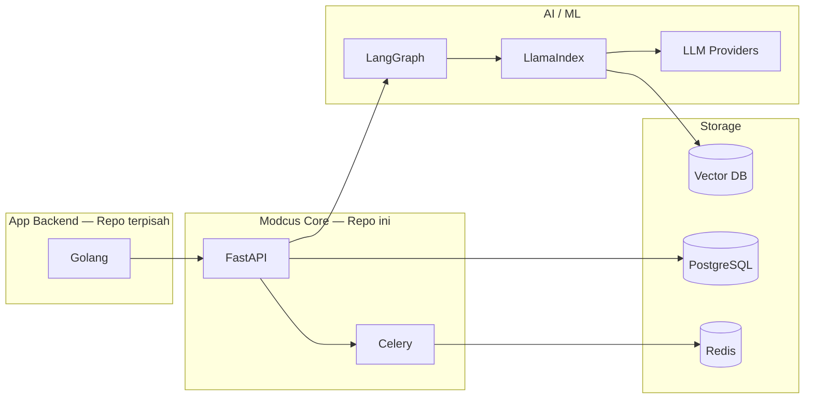
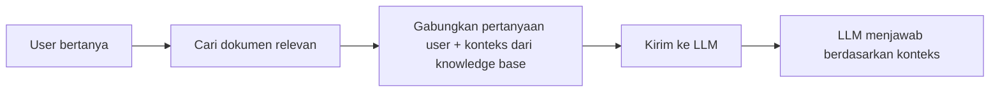

# 04 — Tech Stack

Bagian ini menjelaskan secara mendalam teknologi-teknologi utama yang digunakan di proyek Modcus, menjelaskan **kenapa** kita menggunakan teknologi tersebut dan **bagaimana** teknologi tersebut bekerja.

---

## Overview



---

## ⚡ FastAPI (API Framework)

### Apa itu FastAPI?

**FastAPI** adalah framework Python untuk membuat REST API. FastAPI dipilih karena beberapa alasan:

| Keunggulan           | Penjelasan                                             |
| -------------------- | ------------------------------------------------------ |
| **Cepat**            | Salah satu framework Python tercepat                   |
| **Type-safe**        | Validasi data otomatis berdasarkan type hints Python   |
| **Auto-docs**        | Otomatis men-generate dokumentasi Swagger/OpenAPI      |
| **Async**            | Built-in support untuk async/await                     |
| **Mudah dipelajari** | Syntax mudah dipahami dan dokumentasi yang sangat baik |

### Contoh Dasar

```python
from fastapi import FastAPI, HTTPException, Depends
from pydantic import BaseModel

app = FastAPI(title="Modcus API")

class QueryRequest(BaseModel):
    """Request body untuk query endpoint."""
    query: str
    mode: str
    level: str

@app.post("/v1/query/chat")
async def query_chat(
    request: QueryRequest,
    api_key: str = Depends(verify_api_key),  # Authentication
) -> dict:
    """Handle query dari user.

    Args:
        request: Query request body
        api_key: API key yang sudah divalidasi

    Returns:
        Jawaban dari knowledge base

    Raises:
        HTTPException: Jika request tidak valid
    """
    if request.mode not in ["company-analysis", "stock-recommendation", "document-analysis"]:
        raise HTTPException(status_code=400, detail="Invalid mode")

    result = await process_query(request)
    return {"answer": result.answer, "sources": result.sources}
```

### Dependency Injection

FastAPI menggunakan konsep **Dependency Injection (DI)** — yaitu design pattern di mana sebuah fungsi "menerima" dependency-nya dari luar, bukan membuat atau meng-instantiate objec itu sendiri. Ini memudahkan testing dan menjaga code tetap modular.

```python
from fastapi import Depends
from sqlmodel import Session

# Dependency: database session, biasanya di-define di file terpisah
def get_db_session() -> Session:
    """Membuat database session baru."""
    with Session(engine) as session:
        yield session

# Route menggunakan dependency
@app.get("/v1/rag/jobs")
async def list_jobs(db: Session = Depends(get_db_session)):
    """List semua jobs."""
    return db.query(Job).all()
```

---

## 🗄️ PostgreSQL (Database)

### Apa itu PostgreSQL?

**PostgreSQL** (atau "Postgres") adalah database relasional yang sangat powerful dan reliable.

### Kenapa PostgreSQL?

| Aspek                  | Penjelasan                                                                                      |
| ---------------------- | ----------------------------------------------------------------------------------------------- |
| **Reliability**        | ACID-compliant, data tidak akan corrupt                                                         |
| **JSON Support**       | Bisa menyimpan data JSON (berguna untuk kolom tertentu seperti metadata)                        |
| **pgvector Extension** | Bisa menyimpan vector embeddings langsung di Postgres (kalau tidak menggunakan ChromaDB/Qdrant) |
| **Mature**             | Sudah 30+ tahun, sangat stable dan well-documented                                              |

### SQLModel & SQLAlchemy

Di Modcus, kita **tidak menulis SQL mentah**. Kita menggunakan **ORM (Object-Relational Mapper)** yang bernama **SQLModel** (menggunakan library SQLAlchemy).

```python
from sqlmodel import SQLModel, Field
from datetime import datetime
from typing import Optional

class Job(SQLModel, table=True):
    """Model database untuk tracking ingestion jobs."""
    __tablename__ = "jobs"

    id: int = Field(default=None, primary_key=True)
    document_id: int = Field(foreign_key="documents.id", index=True)
    status: str = Field(default="pending", description="Status job saat ini")
    progress: float = Field(default=0.0, ge=0.0, le=100.0, description="Progress dalam persen")
    stage: Optional[str] = Field(default=None, description="Stage pipeline saat ini")
    created_at: datetime = Field(default_factory=datetime.utcnow)
    updated_at: datetime = Field(default_factory=datetime.utcnow)
```

**Keuntungan SQLModel:**

- Sekali menulis code bisa untuk database schema DAN Pydantic model (class)
- Auto-completion dan type checking
- Validasi data otomatis

---

## 🤖 RAG (Retrieval-Augmented Generation)

### Apa itu RAG?

**RAG** adalah teknik AI yang menggabungkan **retrieval** (pencarian informasi) dengan **generation** (generate jawaban oleh LLM). Tanpa RAG, LLM hanya bisa menjawab berdasarkan data yang digunakan saat training. Dengan RAG, LLM bisa menjawab berdasarkan data baru yang kita berikan.

### Analogi

Bayangkan kamu ujian:

- **Tanpa RAG** = Ujian closed-book. Kamu hanya bisa jawab dari apa yang kamu ingat (data training).
- **Dengan RAG** = Ujian open-book. Kamu boleh buka referensi (knowledge base) dan menjawab berdasarkan apa yang kamu temukan.

### Alur RAG



**Langkah detail:**

1. **User bertanya:** "Apa pendapatan BBCA tahun 2024?"
2. **Retrieval:** Sistem mencari chunks dokumen yang membahas pendapatan BBCA 2024
3. **Augmentation:** Pertanyaan digabung dengan chunks yang ditemukan sebagai konteks
4. **Generation:** LLM membaca konteks dan menghasilkan jawaban yang grounded in data

### Vector Embeddings

**Vector embedding** adalah representasi numerik dari teks. 2 teks yang memiliki makna yang mirip akan memiliki vector yang mirip juga.

```
"Pendapatan BBCA naik 12%"   →  [0.23, -0.45, 0.12, ...]
"Revenue BBCA meningkat"     →  [0.24, -0.44, 0.11, ...]   ← Mirip
"Cuaca cerah hari ini"       →  [0.87, 0.92, -0.31, ...]   ← Beda jauh
```

Sistem menyimpan semua embeddings di **vector database** dan melakukan **similarity search** saat user bertanya.

Untuk membuat embedding atau meng-convert raw text menjadi embedding vector, kita menggunakan model Embedding yang disediakan 3rd party:
- OpenAI (`text-embedding-004`)
- Google (`gemini-embedding-001`)

---

## 🦙 LlamaIndex (RAG Engine)

### Apa itu LlamaIndex?

**LlamaIndex** adalah framework Python untuk membangun aplikasi RAG. LlamaIndex menyediakan tools untuk:

1. **Loading** — Membaca data dari berbagai sumber (dokumen PDF, database eksternal, 3rd-party API)
2. **Indexing** — Membangun index dari data yang dimuat
3. **Querying** — Mencari dan mengambil data dari index

> Catatan: Ingestion vs Indexing
> - Ingestion adalah proses yang kita buat untuk mengubah raw document menjadi knowledge base
> - Indexing adalah proses memasukkan sebuah potongan dokumen ke dalam database
>
> Indexing adalah salah satu bagian dari Ingestion

### Kenapa LlamaIndex?

Sebelumnya kita menggunakan library bernama LightRAG yang membangun knowledge graph (hubungan antar entitas), bukan sekedar vector index atau vector database. Memang data yang dihasilkan bagus. Masalahnya, proses ini sangat lambat dan mahal.

LlamaIndex menggunakan pendekatan yang lebih sederhana: **vector-based retrieval**. Lebih cepat, lebih murah, dan hasilnya cukup untuk use case kita.

| Aspek              | LightRAG (Lama) | LlamaIndex (Baru) |
| ------------------ | --------------- | ----------------- |
| Pendekatan         | Knowledge Graph | Vector Index      |
| Ingestion speed    | 5-15 jam        | < 60 detik        |
| Kualitas retrieval | Sangat baik     | Baik              |
| Maintenance        | Kompleks        | Sederhana         |

> Catatan: Keuntungan LlamaIndex juga kita bisa meng-custom proses ingestion dengan menambahkan fitur tertentu seperti knowledge graph kita sendiri. Ini tidak bisa dilakukan dengan LightRAG karena semua prosesnya sudah built-in.

### Penggunaan di Modcus

```python
from llama_index.core import VectorStoreIndex, SimpleDirectoryReader

# 1. Load dokumen
documents = SimpleDirectoryReader("./data").load_data()

# 2. Buat index
index = VectorStoreIndex.from_documents(documents)

# 3. Query
query_engine = index.as_query_engine()
response = query_engine.query("Apa pendapatan BBCA 2024?")
print(response)
```

---

## 🕸️ LangGraph (Query Orchestration)

### Apa itu LangGraph?

**LangGraph** adalah saudara dari LangChain, yaitu library untuk membangun **agentic workflows** — alur kerja yang melibatkan beberapa "agent" AI yang bekerja sama secara terstruktur.

### Kenapa LangGraph?

Query pipeline Modcus terdiri dari **5 tahap** (validation, ticker inference, retrieval, analysis, formatting). Dengan LangGraph, kita bisa:

- Mendefinisikan setiap step sebagai **node** (agent) yang terpisah
- Mendefinisikan **edges** (alur) antar node dengan kondisi tertentu
- Menangani **error** dan **retry** di setiap node
- Me-**monitor** dan **debug** pipeline dengan mudah

### Contoh Sederhana

```python
from langgraph.graph import StateGraph, END

# Definisikan state
class QueryState:
    query: str
    mode: str
    ticker: str = None
    context: list = []
    answer: str = None

# Definisikan graph
workflow = StateGraph(QueryState)

# Tambahkan nodes
workflow.add_node("validate", validation_agent) # <-- code untuk agent dibuat di file terpisah
workflow.add_node("infer_ticker", ticker_inference_agent)
workflow.add_node("retrieve", retrieval_agent)
workflow.add_node("analyze", analysis_agent)
workflow.add_node("format", response_formatter)

# Tambahkan edges
workflow.add_edge("validate", "infer_ticker")
workflow.add_edge("infer_ticker", "retrieve")
workflow.add_edge("retrieve", "analyze")
workflow.add_edge("analyze", "format")
workflow.add_edge("format", END)

# Compile dan jalankan
app = workflow.compile()
result = app.invoke({"query": "Apa pendapatan BBCA?", "mode": "company-analysis"})
```

---

## ⚙️ Celery & Redis (Background Jobs)

### Apa itu Celery?

**Celery** adalah framework untuk menjalankan **background tasks** di Python. Di project ini, Celery digunakan untuk memproses dokumen karena proses ingestion (misal. parsing, embedding, dan indexing) bisa memakan waktu lama. Jadi, proses ingestion tidak mengganggu API yang berjalan.

### Apa itu Redis?

**Redis** adalah database yang disimpan di memori (in-memory), bukan di hard disk. Jadi, proses menambah/mengambil data sangat cepat daripada database relasional seperti PostgreSQL. Di project ini, Redis berperan sebagai **message broker** — pengantar pesan antara Ingestion API dan Celery workers.

> Catatan: Ingestion API tidak berkomunikasi dengan Celery worker menggunakan HTTP/API, tapi dengan menyimpan job baru ke Redis. Celery worker akan mendeteksi ada background job baru secara otomatis dan langsung menjalankan job itu.

### Alur Kerja

```
User upload PDF ──→ API menerima request baru ──→ Kirim task/job ke Redis ──→ Celery worker mengambil dan memproses dokumen
                    (response 202)                   (message broker)
```

**Kenapa background processing?**

- Endpoint akan langsung return `202 Accepted` (kita tidak perlu menunggu sampai ingestion selesai)
- Kita bisa cek progress via endpoint `/v1/rag/jobs/{id}`
- Kalau gagal, Celery otomatis retry

### Contoh Task

```python
from modcus_common.celery_app import celery_app

@celery_app.task(
    bind=True,
    max_retries=3,
    default_retry_delay=60,
)
def process_document(self, job_id: int) -> dict:
    """Memproses dokumen di background.

    Args:
        job_id: ID job yang akan diproses

    Returns:
        Status hasil pemrosesan
    """
    try:
        # Parse → Chunk → Embed → Index
        result = run_pipeline(job_id)
        return {"status": "completed", "chunks": result.num_chunks}
    except TransientError as e:
        # Retry untuk error sementara (rate limit, timeout)
        raise self.retry(exc=e)
```

---

## 🛡️ Pydantic (Data Validation)

### Apa itu Pydantic?

**Pydantic** adalah library Python untuk mendefinisikan sebuah data seperti mendefinisikan sebuah Class, disertai **validasi data** otomatis menggunakan type hints. Pydantic memastikan data yang masuk ke sistem selalu dalam format yang benar.

### Contoh

```python
from pydantic import BaseModel, Field
from typing import Optional

class QueryRequest(BaseModel):
    """Request body untuk query endpoint."""
    query: str = Field(..., min_length=1, max_length=5000, description="Pertanyaan user")
    mode: str = Field(..., description="Mode query: company-analysis, stock-recommendation, document-analysis")
    level: str = Field(default="novice", description="Level presentasi: newbie, novice, expert")
    ticker: Optional[str] = Field(default=None, description="Kode saham (opsional, bisa di-infer)")

# Validasi otomatis
try:
    req = QueryRequest(query="", mode="invalid")  # Akan error!
except ValidationError as e:
    print(e)
    # query: String should have at least 1 character
```

---

## 📝 Loguru (Logging)

### Apa itu Loguru?

**Loguru** adalah library untuk melakukan print logging di Python. Project ini menggunakan Logurum, bukan library `logging` bawaan Python — **jangan gunakan `import logging`**.

### Penggunaan

```python
from loguru import logger

# Import langsung, tidak perlu konfigurasi
logger.info("Server starting on port 8080")
logger.debug("Processing query: {query_text}")
logger.warning("Rate limit approaching: {current_count}/100")
logger.error("Failed to process document: {error_message}")

# Context binding (menambahkan konteks)
job_logger = logger.bind(job_id="job-123", ticker="BBCA")
job_logger.info("Starting pipeline")
job_logger.info("Parsing complete, {num_chunks} chunks")
```

### Log Levels

| Level     | Kapan Digunakan                                     |
| --------- | --------------------------------------------------- |
| `DEBUG`   | Detail teknis untuk debugging saat development      |
| `INFO`    | Operasi normal yang perlu dicatat                   |
| `WARNING` | Hal yang mungkin jadi masalah ke depan              |
| `ERROR`   | Error yang perlu ditangani tapi service masih jalan |

---

## Vector Databases

### Apa itu Vector Database?

**Vector Database** adalah database khusus untuk menyimpan dan mencari vector embeddings. Berbeda dengan database relasional yang mencari berdasarkan exact match, vector database mencari berdasarkan **kesamaan semantik** (makna yang mirip).

### Database yang digunakan (salah 1)

| Database                  | Keunggulan                           | Kapan Digunakan       |
| ------------------------- | ------------------------------------ | --------------------- |
| **ChromaDB**              | Mudah setup, bagus untuk development | Development & testing |
| **Qdrant**                | High-performance, scalable           | Production            |
| **PostgreSQL + pgvector** | Langsung integrate ke Posgre utama   | Production            |

---

## Tech Stack Lengkap

| Kategori                | Teknologi               | Versi  |
| ----------------------- | ----------------------- | ------ |
| **Bahasa**              | Python                  | 3.11+  |
| **API Framework**       | FastAPI                 | Latest |
| **ORM**                 | SQLModel + SQLAlchemy   | Latest |
| **Data Validation**     | Pydantic                | v2     |
| **Background Jobs**     | Celery                  | Latest |
| **Message Broker**      | Redis                   | Latest |
| **Database**            | PostgreSQL              | 15+    |
| **RAG Engine**          | LlamaIndex              | Latest |
| **Agent Orchestration** | LangGraph               | Latest |
| **Logging**             | Loguru                  | Latest |
| **Package Manager**     | uv                      | Latest |
| **Containerization**    | Docker + Docker Compose | Latest |
| **Documentation**       | MkDocs                  | Latest |

---

## Apa Selanjutnya?

Sekarang lanjut ke bagian berikutnya untuk **setup environment di device lokal**:

➡️ [05 — Setup Lokal](05-setup-lokal.md)
