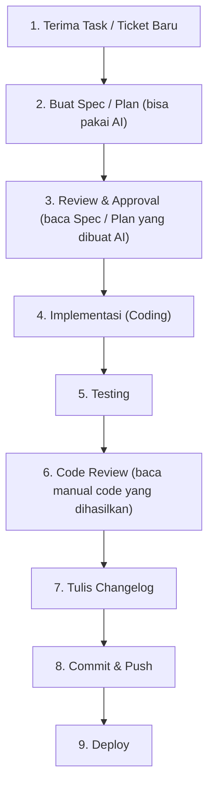
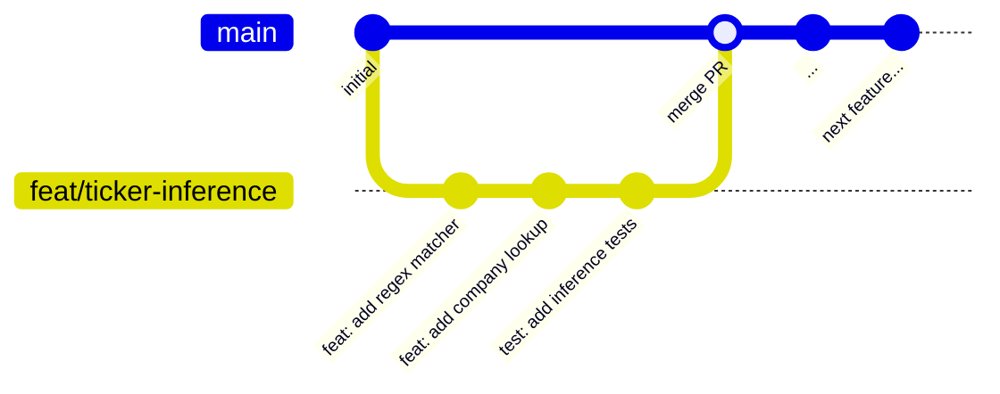

# 06 — Workflow Saat Development (Alur Kerja)

Bagian ini menjelaskan cara kerja tim Modcus sehari-hari — dari perencanaan hingga deployment.

---

## Pendekatan

Tim Modcus menggunakan pendekatan **Spec-Driven Development** — setiap pekerjaan dimulai dari **spesifikasi tertulis** sebelum coding dimulai.

Biasanya kita juga pakai AI coding agent seperti GitHub copilot, Cursor, Antigravity, atau OpenCode. Pendekatan **Spec-Driven Development** bisa diterapkan saat menggunakan AI coding agent supaya hasil kodingan lebih konsisten dan sesuai dengan spesifikasi.

### Alur Kerja Umum



---

## Spec-Driven Development

### Apa itu Spec?

**Spec (spesifikasi)** adalah dokumen yang menjelaskan secara detail **fitur apa** yang akan dibuat, **latar belakang** tugas yang diberikan, **bagaimana** meng-implementasikan fitur tersebut, dan **kenapa** memilih implementasi tersebut. Spec ditulis **sebelum** coding dimulai.

**Kenapa harus tulis spec dulu?**

1. Supaya kita punya perencanaan jelas sebelum coding
2. Tim yang lain juga bisa review dan memberikan feedback sebelum ada code ditulis
3. Menjadi dokumentasi dari apa yang dibuat
4. Mengurangi refactoring/fix yang tidak perlu

### Struktur Spec

Spec bisa disimpan di 2 tempat:
- `docs/docs/specs/[tanggal]_[jam]_[deskripsi]/`
atau
- `agent-os/specs/[tanggal]-[jam]-[deskripsi]/`

Contoh lihat di:
- [`agent-os/specs/2026-02-10-0755-settings-endpoint/plan.md`](../../../agent-os/specs/2026-02-10-0755-settings-endpoint/plan.md)

```
docs/docs/specs/
├── 2026-02-20_1200_auto-detect-ticker/
│   ├── plan.md                   # Spesifikasi
│   ├── references.md             # Referensi
│   ├── shape.md                  # Struktur code
│   ├── standards.md              # Guideline jika menggunakan AI
│   └── CHANGELOG.md              # Hasil pekerjaan
└── ...
```

### Contoh Spec Sederhana

```markdown
# Fitur: Auto-detect Ticker dari Query

## Latar Belakang
User sering bertanya tanpa menyebutkan ticker secara eksplisit.
Contoh: "Bagaimana profitabilitas Bank Central Asia?" (harusnya BBCA)

## Requirements
- Sistem harus bisa mendeteksi ticker dari nama perusahaan
- Support nama full dan alias (BCA → BBCA)
- Akurasi target: 95%+

## Pendekatan
1. Regex matching untuk ticker format (4 huruf kapital)
2. Fuzzy matching ke database perusahaan

## Testing Plan
- Unit test untuk setiap pola
- Integration test dengan query nyata
```

---

## Branching Strategy

### Branch

| Branch       | Kegunaan     | Contoh                           |
| ------------ | ------------ | -------------------------------- |
| `main`       | Branch utama | -                                |
| `feat/*`     | Fitur baru   | `feature/ticker-inference`       |
| `fix/*`      | Bug fix      | `fix/parsing-error`              |
| `refactor/*` | Refactoring  | `refactor/separate-api-platform` |

### Alur Branch



### Workflow Harian

```bash
# 1. Pastikan main up-to-date
git checkout main
git pull origin main

# 2. Buat branch baru dari main
git checkout -b feat/nama-fitur

# 3. Coding... commit secara teratur
git add .
git commit -m "feat: add new feature"

# 4. Push ke remote
git push origin feat/nama-fitur

# 5. Buat Pull Request di GitHub
```

---

## Conventional Commits (Detail)

### Format

```
<type>(<scope>): <deskripsi>

[body - opsional]

[footer - opsional]
```

### Contoh

```bash
# Fitur baru
feat(ingest): add LlamaParse JSON format support
feat(query): implement ticker inference agent
feat(common): add LLM key rotator

# Bug fix
fix(ingest): resolve foreign key violation in llm_logger
fix(query): handle None index gracefully with 503 response
fix(common): add missing log_dir attribute to BaseSettings

# Refactoring
refactor(api): separate platform and core API endpoints
refactor(ingest): simplify chunking pipeline

# Dokumentasi
docs: add onboarding documentation
docs(api): update endpoint descriptions

# Chores
chore: update Docker base image to Python 3.12
chore(deps): upgrade pydantic to v2.5
```

### Scope yang Biasa Digunakan

| Scope    | Kapan Dipakai                  |
| -------- | ------------------------------ |
| `ingest` | Perubahan di ingestion service |
| `query`  | Perubahan di query service     |
| `common` | Perubahan di common module     |
| `api`    | Perubahan khusus di API layer  |
| `deps`   | Perubahan dependency           |
| `config` | Perubahan konfigurasi          |
| `docker` | Perubahan Docker/Compose       |

### Tips Commit yang Baik

1. **Satu commit = satu perubahan logis.** Jangan campur fitur baru dengan bug fix dalam satu commit.
2. **Commit sering.** Lebih baik banyak commit kecil daripada satu commit besar.
3. **Deskripsi jelas.** Orang lain harus bisa memahami apa yang berubah hanya dari commit message.
4. **Gunakan bahasa imperative.** "add feature" bukan "added feature" atau "adding feature".

---

## Code Review

### Prinsip Code Review

1. **Bukan persoalan pribadi, tapi tentang kualitas code.** Feedback di code review bukan tentang personal.
2. **Berikan feedback yang konstruktif.** Jelaskan *kenapa* sesuatu harus diubah, bukan hanya bilang "salah".

### Checklist Review

Saat me-review kode (atau sebelum submit PR), cek hal-hal berikut:

- [ ] Apakah ada **type hints** di semua fungsi?
- [ ] Apakah ada **docstring** yang menjelaskan Args, Returns, Raises?
- [ ] Apakah ada **error handling** yang proper?
- [ ] Apakah ada **logging** yang cukup untuk debugging?
- [ ] Apakah kode mengikuti **konvensi proyek** (lihat [`AGENTS.md`](../../../AGENTS.md))?
- [ ] Apakah tidak ada **hardcoded values** (gunakan settings/config)?
- [ ] Apakah tidak ada **import langsung** antar service?
- [ ] Apakah ada **tests** untuk kode baru?

---

## Standar Kode

### Wajib di Setiap Fungsi

```python
# ✅ BENAR — fungsi dengan type hints, docstring, dan error handling
async def get_job_by_id(job_id: int, db: Session) -> Optional[Job]:
    """Mengambil job berdasarkan ID.

    Args:
        job_id: ID job yang dicari
        db: Database session

    Returns:
        Job object jika ditemukan, None jika tidak

    Raises:
        ValueError: Jika job_id negatif
    """
    if job_id < 0:
        raise ValueError(f"Job ID must be positive, got {job_id}")

    logger.debug("Fetching job with id={}", job_id)
    job = db.get(Job, job_id)

    if job is None:
        logger.warning("Job not found: id={}", job_id)

    return job
```

```python
# ❌ SALAH — tidak ada type hints, docstring, atau logging
def get_job(id, db):
    return db.get(Job, id)
```

### Import Ordering

Import sebaiknya dikelompokkan dalam 4 grup:

```python
# 1. Standard library
import os
from datetime import datetime
from typing import Optional

# 2. Third-party packages
from fastapi import FastAPI, HTTPException
from pydantic import BaseModel
from loguru import logger

# 3. modcus_common (shared library)
from modcus_common.models import Job, Document
from modcus_common.settings import BaseSettings

# 4. Local imports (dari service yang sama)
from .services.parsing import DoclingParser
from .settings import IngestSettings
```

---

## Apa Selanjutnya?

Lanjut ke bagian berikutnya tentang menggunakan **AI coding agents**:

➡️ [07 — AI Agent & Coding](07-ai-agent-coding.md)
