# 🚀 Onboarding: Selamat Datang di Tim Modcus!

Selamat datang di tim developer AI **Modcus**! Dokumen ini adalah panduan onboarding untuk developer baru yang bergabung di proyek ini. Di sini dijelaskan semua hal yang dibutuhkan untuk mulai bekerja.

---

## 📋 Apa yang Akan Kamu Pelajari?

Panduan onboarding ini dibagi menjadi beberapa bagian yang sebaiknya kamu baca **secara berurutan**:

| No. | Bagian                                                         | Deskripsi                                                                                                         |
| --- | -------------------------------------------------------------- | ----------------------------------------------------------------------------------------------------------------- |
| 01  | [Pengenalan Proyek](01-pengenalan-proyek.md)                   | Apa itu Modcus? Visi, misi, latar belakang, dan tujuan proyek.                                                    |
| 02  | [Konsep Dasar](02-konsep-dasar.md)                             | Pengenalan konsep fundamental yang kita gunakan.                                                                  |
| 03  | [Arsitektur Sistem](03-arsitektur-sistem.md)                   | Bagaimana sistem ini dibangun dan bagaimana komponen-komponennya bekerja.                                         |
| 04  | [Tech Stack](04-tech-stack.md)                                 | Deep-dive ke teknologi yang digunakan: FastAPI, PostgreSQL, RAG, LlamaIndex, dll.                                 |
| 05  | [Setup Lokal](05-setup-lokal.md)                               | Panduan step-by-step untuk menyiapkan environment (Windows/Mac/Linux).                                            |
| 06  | [Workflow (Alur Kerja)](06-workflow.md)                        | Cara kerja tim: Agile, spec-driven development, commit, dan PR.                                                   |
| 07  | [AI Coding Agent](07-ai-coding-agent.md)                       | Menggunakan AI coding agent (Cursor, GitHub Copilot, OpenCode, Claude Code, Antigravity) untuk mempercepat kerja. |
| 08  | [Dokumentasi & Changelog](08-dokumentasi-dan-changelog.md) | Cara menulis changelog dan dokumentasi setelah menyelesaikan task/ticket.                                         |
| 09  | [Glosarium](09-glosarium.md)                                   | Daftar istilah dan terminologi yang sering digunakan.                                                             |

---

## 🎯 Roadmap Onboarding

Berikut langkah-langkah yang direkomendasikan:

```mermaid
graph TD
    A["1. Baca Pengenalan Proyek"] --> B["2. Pelajari Konsep Dasar"]
    B --> C["3. Pahami Arsitektur Sistem"]
    C --> D["4. Kenali Tech Stack-nya"]
    D --> E["5. Setup Laptop/PC"]
    E --> F["6. Pelajari Workflow Tim"]
    F --> G["7. Coba AI Coding Agent"]
    G --> H["8. Pahami Standar Dokumentasi"]
    H --> I["🎉 Siap Mulai Kerja!"]
```

---

## 💡 Tips untuk Developer Baru

1. **Jangan takut bertanya.** Kalau ada yang kurang jelas, langsung tanya ke yang lain.
2. **Baca code yang sudah ada** sebelum menulis code baru (pelajari pola dan konvensi yang digunakan). Di sini kita memang belum 100% strict soal pattern/style koding, standard koding yang kita pakai juga kadang berubah. Tapi lebih bagus kalau dibiasakan kita punya style koding yang sama.
3. **Gunakan AI coding agent** untuk membantu memahami code yang ada dan menulis code baru.
4. **Commit secara teratur.** Jangan menumpuk banyak kerjaan / changes dalam satu commit besar. Sebisa mungkin, setelah mengerjakan 1 hal, langsung commit. Lebih baik ada beberapa commit kecil-kecil tapi jelas, daripada 1 commit besar tapi campur aduk.
5. **Tulis dokumentasi** setiap kali menyelesaikan task. Penting untuk tracking progress.

---

## 📚 Dokumen Referensi Utama

Selain panduan onboarding ini, berikut dokumen-dokumen penting yang perlu kamu ketahui:

- **[README.md](../../../README.md)** — Gambaran besar proyek dan quick start guide
- **[PROJECT_CONSTITUTION.md](../../../PROJECT_CONSTITUTION.md)** — Aturan dan standar secara teknis
- **[AGENTS.md](../../../AGENTS.md)** — Guidelines (rule) untuk AI coding agent
- **[Epic Brief](../specs/2026-02-03_v0.2-project-rebuild/01-epic-brief.md)** — Detail lengkap tentang v0.2 (versi sekarang)
- **[Technical Plan](../specs/2026-02-03_v0.2-project-rebuild/03-technical-plan.md)** — Rencana teknis arsitektur v0.2 (versi sekarang)

Selamat belajar dan selamat bergabung di tim! 🎉
