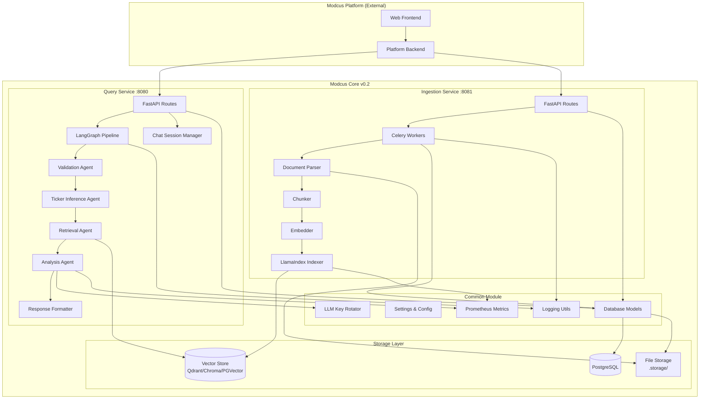
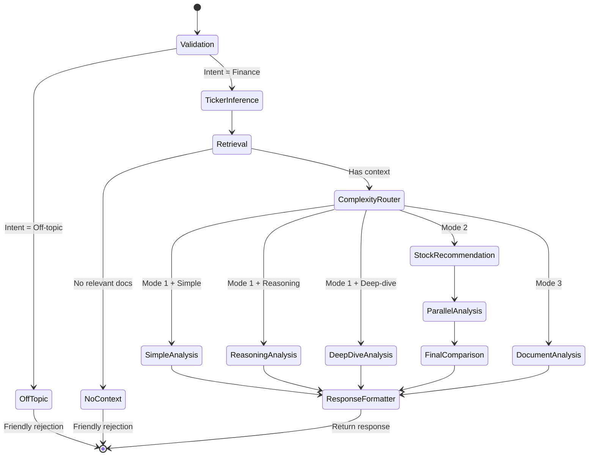

# Epic Brief: Modcus Core v0.2 - LlamaIndex & LangGraph Rebuild

**Version:** 0.2.0  
**Status:** Planning  
**Epic ID:** epic:7a9bea0a-9642-4cd3-b4d3-cbc00fd624f6  
**Created:** 2026-02-03  
**Last Updated:** 2026-02-03

---

## Executive Summary

Modcus Core v0.2 represents a complete architectural rebuild of the RAG-powered financial Q&A and stock recommendation engine. This initiative moves away from RAG-Anything/LightRAG to a new foundation built on **LlamaIndex** (RAG engine) and **LangGraph** (query orchestration), addressing critical performance, cost, and scalability issues while preserving all essential features and improving system robustness.

**Key Outcomes:**

- ✅ **10x faster ingestion** - Eliminate expensive knowledge graph construction
- ✅ **90% cost reduction** - Reduce LLM token usage during indexing
- ✅ **Agentic query pipeline** - LangGraph orchestrates 5 specialized agents
- ✅ **Pluggable architecture** - Support multiple vector stores (Qdrant, ChromaDB, PostgreSQL+pgvector)
- ✅ **Fresh start** - Clean codebase with modern patterns and best practices

---

## 1. Problem Statement

### 1.1 Current System Limitations

The existing Modcus Core (v0.1) is powered by **RAG-Anything** and **LightRAG**, which build comprehensive knowledge graphs from ingested documents. While this approach provides robust entity-relationship extraction, it has proven to be:

**Critical Issues:**

1. **Extremely Slow Ingestion** - Processing 100-200 page PDFs takes 5-15 hours due to complex graph construction
2. **Prohibitively Expensive** - LLM token costs for entity/relationship extraction are 10-50x higher than standard RAG
3. **Resource Intensive** - High memory and compute requirements for graph operations
4. **Scalability Bottleneck** - Target of 500 companies × 6 documents × 5 years = 15,000 documents is impractical

**Impact on Business Goals:**

- Cannot scale to full dataset (15,000 documents) within reasonable time/budget
- Ingestion costs exceed query costs by 100x
- Development velocity slowed by complex library dependencies
- Difficult to iterate and experiment with different RAG strategies

### 1.2 Root Cause Analysis

From file:docs/docs/planning/01-context-layer-refactoring/00-brief.md and docs/docs/integrations/raganything-lightrag-usage.md:

> "LightRAG has a very complex underlying inner workings. Most of the cost comes from the sheer amount of LLM calls needed for ingestion. As far as I know, it not only generate basic text embeddings and vector indices, but also identify entities, build relationships, etc."

**Why Knowledge Graphs Are Expensive:**

- Entity extraction requires LLM calls per chunk
- Relationship inference requires cross-chunk analysis
- Graph merging and deduplication adds complexity
- Incremental updates require graph reconstruction

**Decision:** Defer knowledge graph capabilities to v0.3, focus on efficient vector-based RAG for v0.2.

---

## 2. Original User Brief (Preserved Verbatim)

> Modcus is an AI-powered, intelligent financial Q&A system and stock recommendation engine, presented as a chatbot app. Modcus Core (this repo) is the main, core RAG engine that processes user queries and generate an answer, whether it is a simple question or a deep-dive stock and market analysis. Modcus Platform is a companion repo that utilizes the Modcus Core system and wraps it in a presentable format, in the form of a chatbot web app with a frontend and a backend.
>
> Refer to the file:docs/docs/MODCUS_MASTER_DOCUMENT.md for the full project details, including the project's epic, background, brief, requirements, features, etc.
>
> The Modcus Core system is originally powered by the **RAG-Anything** (and **LighRAG**) engine. It is split into 2 main services: the Ingestion and Query services. The Ingestion service is responsible for ingesting raw, source documents and processing them to build a huge Knowledge Base for the RAG system to retrieve context from. The Query service is responsible for connecting to the storage backends that store the Knowledge Base, retrieving relevant context from the Knowledge Base, processing user queries and generating answers.
>
> However, after some testing, we found out that the **RAG-Anything** and **LightRAG** library has a major flaw. Although the design is robust, where it builds a knowledge graph from all the entities that are found within the documents and their relationships, this makes the ingestion process very slow, resource-intensive, and very expensive. You MUST refer to file:docs/docs/planning/01-context-layer-refactoring/00-brief.md and docs/docs/integrations documents for more context.
>
> Therefore, I want to build a new iteration/version of the Modcus Core system, which will be more efficient, faster, and cheaper to run. We will not use **RAG-Anything** or **LighRAG** anymore. We will integrate it with other frameworks and libraries such as **LangChain**, **LlamaIndex**, **RAGFlow**, and others. The source code for the new iteration/version will still be in this repo, and the old code would be moved to a legacy directory.
>
> We will build it from scratch. The overall architecture would still be similar, using some of the same frameworks and libraries such as `FastAPI`, `loguru`, `rich`, `pydantic`, and others. It would still be split into 2 mains services, a Ingestion service and a Query service, with separate Docker Compose configuration and separate dependencies. This is because the Ingestion service would be much of a "one-time process", perhaps running one every week at most. While the Query service needs to run 24/7 to handle user requests.
>
> There would also be a commond module, i.e. the `modcus_common` module, that stores shared code such as database models, settings, and other shared utilities which needs to be exactly the same for both the Ingestion and Query processes.
>
> The requirements and features for the project remain the same. The Ingestion service and the Query service does the same thing. The Ingestion service would accept either a PDF or a JSON with the DoclingDocument for LlamaParse format, processes it, then inserts it into the database index (or whatever the storage backend implementation is). The Query service is an agentic-based Q&A engine divided into 3 main modes: Company Analysis, Stock Recommendation, and Document Analysis. The 3 query modes are selected by the user and sent as a parameter on the request. The Company Analysis mode (Mode 1) is further divided into 3 levels of complexity: a simple factual recall; a more complex reasoning with inference, implication, and Chain-of-Thought; and a structured deep-dive stock analysis with the value investing and growth investion principles. The 3 complexity levels are not selected explicitly by the user, but inferred automatically by the query engine (e.g. via LLM). The Stock Recommendation mode (Mode 2) is basically a summary of Mode 1-Level 3 (stock analysis), where 5 or more stocks are analyzed and compared against each other. Mode 3 is basically similar to Mode 1 but with the user's own uploaded documents.
>
> One important thing to note is that the Query engine MUST always work as a regular, RAG-based answer generator with agentic approach that can answer any kinds of questions. However, it is specialized on the domain of finance, market, and investing. There should be a "safe-guard" where questions that aren't in the expertise of the AI should be "rejected" with a friendly message. But questions that are still related to the expertise, although not specific about any company, should still be answered correctly. For example, if the user asks "What is P/E ratio?", the system should still generate the most relevant answer even though it is not specifically about analyzing a company's stock.
>
> The old code for `modcus_api_ingest`, `modcus_api_query`, `modcus_common`, and `modcus_migration` would be moved to the `legacy/v0.1` directory, alongside the current Docker Compose files, `.env`/`.env.example` files, `pyproject.toml` file, `requirements.txt` file, `uv.lock` file, `.dockerignore` file, etc. Also move documentation files that are strictly about the current implementation details to the `legacy/v0.1/docs` directory, e.g. documents that reference API routes, actual code, libraries, etc. For documents that serve as a high-level overview and non-technical details, keep them as is, including the @docs/docs/MODCUS_MASTER_DOCUMENT.md. Try to keep the files and not remove it, but just move it to the legacy v0.1 directory. As for the current files/folders in the `legacy` directory, move it to `legacy/v0.0` directory. We will commit the files and folder move first before continuing with the new version.
>
> The new iteration would also inherit some of the features from the current system, such as:
>
> - LLM API key management and rotator (e.g. changing to another LLM API key if the current one is rate-limited or has an error)
> - LLM API call logging & metrics (e.g. tracking usage, cost, system prompt, user prompt, input/output/thought tokens, etc.)
> - ... (other)
>
> However, I do not want to just copy-paste everything from the old codebase. I am very open to new ideas and suggestions. I want this new iteration to be a significant improvement over the current system. For example, you may suggest another architecture design, another frameworks or code patterns to use, or a much more robust system that most RAG-based chatbot apps use. The goal is to build a robust, efficient, and scalable RAG system that can be used to power a chatbot app.
>
> For this version, let's integrate LlamaIndex as the RAG engine and LangGraph as the query orchestrator. For LlamaIndex usage and best practices, refer to this directory `/home/michb/dev/02-projects/02-aiml/ngoper/need-fast/llamaindex-rag` (a simple chatbot app powered by LlamaIndex) and the official documentations.
>
> Order of importance:
>
> - Quality
> - Efficiency
> - Speed
> - Cost
>
> AI development guidelines:
>
> - Strive for the highest quality, reliability, and efficiency.
> - Think critically when designing the system or when making a decision.
> - Implement best practices, industry standards and the most robust approach.

---

## 3. Solution Overview

### 3.1 Technology Stack

**Core Frameworks:**

- **LlamaIndex** - Vector-based RAG engine with pluggable storage backends
- **LangGraph** - Stateful workflow orchestration for query pipeline
- **FastAPI** - High-performance async web framework
- **Celery** - Distributed task queue for background ingestion
- **SQLModel** - Type-safe ORM for database operations
- **Pydantic** - Data validation and settings management

**Storage Backends (Pluggable):**

- **Qdrant** - Production-grade vector database
- **ChromaDB** - Development-friendly vector store
- **PostgreSQL + pgvector** - Unified database solution
- **Local File Storage** - Raw and parsed files (v0.2)
- **MinIO** - Object storage for files (v0.3, replaces local storage)

**LLM Providers (Hybrid Strategy):**

- LlamaIndex's native LLM abstraction (OpenAI, Anthropic, Gemini, etc.)
- Custom rotation/failover logic for reliability
- Support for multiple providers with automatic fallback

**Observability:**

- **Loguru** - Structured logging with per-job isolation
- **Prometheus** - Metrics and monitoring
- **Rich** - Beautiful console output

### 3.2 Architecture Diagram



### 3.3 Service Boundaries

**Ingestion Service (Port 8081):**

- Document upload and validation
- Background processing via Celery
- Multi-format support (Docling JSON, LlamaParse JSON, raw PDF)
- Per-job log isolation
- Idempotency guarantees

**Query Service (Port 8080):**

- LangGraph-orchestrated query pipeline
- 5 specialized agents (Validation, Ticker Inference, Retrieval, Analysis, Response Formatter)
- Chat session management
- Streaming responses
- Multi-layered safe-guards

**Common Module:**

- Shared database models (fresh schema)
- Settings and configuration
- LLM key rotation logic
- Logging utilities
- Prometheus metrics

---

## 4. Architectural Decisions

### 4.1 LangGraph Query Pipeline (5 Agents)

**Agent Breakdown:**

1. **Validation Agent**
  - API authentication (X-API-Key)
  - Request schema validation
  - Query intent classification (finance-related vs. off-topic)
  - Rate limiting checks
  - **Output:** Validated request + intent classification
2. **Ticker Inference Agent**
  - Extract ticker symbols via regex (`\b[A-Z]{3,5}\b`)
  - Company name matching from database
  - Ambiguity resolution
  - **Output:** List of ticker symbols + confidence scores
3. **Retrieval Agent**
  - Query LlamaIndex with appropriate parameters
  - Filter by allowed documents (ticker scoping)
  - Optional reranking
  - Chunk selection (top_k)
  - **Output:** Retrieved chunks with citations
4. **Analysis Agent**
  - LLM synthesis with comprehensive tools
  - Financial calculators (P/E, DCF, ratios)
  - Data manipulation (filtering, ranking)
  - Text analysis (summarization, sentiment)
  - **Output:** Structured analysis with tool call results
5. **Response Formatter**
  - Structure final output
  - Add citations and metadata
  - Format for presentation level (newbie/novice/expert)
  - **Output:** JSON response ready for client

**LangGraph State Machine:**



### 4.2 Multi-Layered Safe-guards

**Layer 1: Validation Agent (Upfront Classification)**

- Classify query intent before processing
- Configurable strategy via `COMPLEXITY_INFERENCE_MODE` environment variable:
  - `separate`: Separate LLM call for intent + complexity classification (accurate, +1s latency)
  - `combined`: Combined with validation in single LLM call (efficient, default)
- Reject obvious off-topic queries immediately

**Layer 2: LLM Guardrails (System Prompt)**

- Instruct LLM to decline off-topic questions
- Provide examples of acceptable vs. unacceptable queries
- Enforce domain boundaries (finance, investing, markets)

**Layer 3: Post-Retrieval Check**

- If no relevant context found, return friendly rejection
- Avoid hallucination by refusing to answer without evidence

**Examples:**

- ✅ "What is P/E ratio?" → Answer (finance domain knowledge)
- ✅ "Analyze BBCA's profitability" → Answer (company analysis)
- ❌ "What's the weather today?" → Reject (off-topic)
- ❌ "Write me a poem" → Reject (off-topic)

### 4.3 Document Input Strategy

**Single Endpoint with Auto-Detection:**

- `POST /v1/ingestion/upload`
- Auto-detect format based on:
  - File extension (`.json` vs. `.pdf`)
  - JSON schema inspection (Docling vs. LlamaParse structure)
  - Content-Type header

**Supported Formats:**

1. **Docling JSON** - Pre-parsed from external Docling service
   - **Modern Format (v1.8.0+)**: Uses `schema_name: "DoclingDocument"` with `body.children` referencing items in `texts`, `tables`, and `pictures` arrays
   - **Legacy Format**: Uses `pages` array with nested text, tables, and figures per page
   - Detection: Checks for `"schema_name": "DoclingDocument"` in JSON

2. **LlamaParse JSON** - Pre-parsed from LlamaParse cloud
   - Format: Contains `job_id` and `pages` array at top level
   - Detection: Checks for `job_id` and `pages` keys in JSON

3. **Raw PDF** - Use LlamaIndex's `SimpleDirectoryReader` or `PDFReader`
   - Detection: File extension `.pdf`

**Important:** This repo MUST NOT perform PDF parsing with Docling/LlamaParse. Only accept pre-parsed JSON.

### 4.4 Multi-Tier Document Classification

**Tier A: Annual Reports & Financial Statements**

- High-value, dense financial data
- Metadata: `tier=A`, `doc_type=annual_report|financial_statement`

**Tier B: Public Expose & News**

- Voluminous, often repetitive
- Metadata: `tier=B`, `doc_type=public_expose|news`

**v0.2 Implementation:**

- Metadata-only distinction (same processing pipeline)
- Same chunking, embedding, indexing by default
- Chunking strategy configurable per document type via settings
- Default: 1024 tokens with 200 token overlap for all tiers
- Differentiation via metadata tags for filtering

**Future (v0.3):**

- Tier A → PropertyGraphIndex (knowledge graph)
- Tier B → Vector-only RAG
- Hybrid retrieval combining both
- Tier-specific chunking strategies (Tier A: smaller chunks for precision)

### 4.5 Stock Recommendation Mode (Mode 2)

**Hybrid Parallel + Comparison Strategy:**

1. **Candidate Selection** - Identify stocks to analyze
2. **Parallel Retrieval** - Fetch context for all stocks concurrently
3. **Parallel Analysis** - Run deep-dive analysis per stock in parallel
4. **Final Comparison** - Single LLM call to compare and rank

**Candidate Selection Logic:**

- **Default**: Random selection from available stocks in knowledge base
- **With Sector**: If sector mentioned and market cap data available, select top N by market cap within sector
- **Explicit Tickers**: If user specifies tickers, use those directly
- **Fallback**: If insufficient candidates, return partial results with explanation

**Flow:**

```
User: "Recommend 5 banking stocks"
    ↓
Candidate Selection: Extract sector="banking", select top 5 by market cap
    ↓
Ticker Inference: [BBCA, BMRI, BBNI, BBTN, BRIS]
    ↓
[Parallel] Retrieve context for each ticker
    ↓
[Parallel] Deep-dive analysis per stock (5 concurrent LLM calls)
    ↓
Aggregate results
    ↓
Final comparison LLM call (rank, recommend, explain)
    ↓
Return structured recommendation
```

### 4.6 Pluggable Storage Backends

**Adapter Pattern:**

- Abstract interface: `VectorStoreAdapter`
- Implementations: `QdrantAdapter`, `ChromaDBAdapter`, `PGVectorAdapter`
- Environment-based selection: `VECTOR_STORE=qdrant|chromadb|pgvector`

**Configuration:**

```python
# modcus_common/settings.py
class Settings(BaseSettings):
    vector_store: Literal["qdrant", "chromadb", "pgvector"] = "chromadb"
    
    # Qdrant
    qdrant_url: str = "http://localhost:6333"
    qdrant_api_key: Optional[str] = None
    
    # ChromaDB
    chroma_persist_dir: str = "./chroma_db"
    
    # PGVector
    pgvector_connection_string: str = "postgresql://..."
```

### 4.7 LLM Provider Strategy (Hybrid)

**Leverage LlamaIndex + Custom Rotation:**

1. **LlamaIndex Abstraction** - Use native LLM classes (`OpenAI`, `Gemini`, `Anthropic`)
2. **Custom Rotation Logic** - Wrap LlamaIndex LLMs with failover mechanism
3. **Key Management** - Store multiple API keys per provider in database
4. **Automatic Fallback** - Rotate on rate limits, errors, or timeouts

**Implementation:**

```python
# modcus_common/services/llm_rotator.py
class LLMRotator:
    def __init__(self, provider: str, api_keys: List[str]):
        self.provider = provider
        self.api_keys = api_keys
        self.current_index = 0
    
    def get_llm(self) -> BaseLLM:
        # Return LlamaIndex LLM with current key
        # Rotate on failure
        pass
```

---

## 5. Features to Preserve

All 10 critical features from v0.1 will be preserved:

### 5.1 LLM API Key Management & Rotation

- Store multiple keys per provider in `ApiKey` table
- Automatic rotation on rate limits or errors
- Health checks and key validation

### 5.2 Comprehensive LLM Call Logging

- Track every LLM interaction in `LLMCall` table
- Fields: provider, model, latency, tokens (input/output/total), cost, prompts, responses
- Enable cost analysis and debugging

### 5.3 Per-Job Log Isolation

- Separate log files per ingestion job: `./logs/jobs/{job_id}/pipeline.log`
- Attach/detach log handlers dynamically
- Preserve global logs for service-level events

### 5.4 Celery Background Workers

- Async ingestion processing
- Configurable concurrency (1 worker per core)
- Job status tracking and progress updates

### 5.5 Multi-Tier Document Classification

- Tier A vs. Tier B metadata tagging
- Future-ready for graph-based processing

### 5.6 Ticker Inference System

- Regex-based ticker extraction
- Company name matching from database
- Ambiguity resolution

### 5.7 Chat Session Management

- Conversation history tracking
- Session-based context retention
- Support for follow-up questions
- Configurable session timeout (default: 2 hours)
- Full history retention with automatic summarization when approaching context window limits
- History branching: Create summary branch while preserving original conversation

### 5.8 Prometheus Metrics

- Query latency, throughput
- Ingestion metrics (docs/sec, chunks/sec)
- LLM token usage and costs
- Error rates by endpoint

### 5.9 Idempotency Keys

- Prevent duplicate job creation
- Honor `Idempotency-Key` header
- Return existing job if key matches

### 5.10 Document Deletion with Audit Trail

- Safe deletion by `doc_id`
- Full cleanup: removes raw files, parsed files, vector embeddings, and database records
- Audit log in `DeletionLog` table with deletion scope details
- Irreversible operation with confirmation required

---

## 6. Core Principles (Preserved from v0.1)

From file:AGENTS.md:

### 6.1 Code Modularity

- Clear separation of concerns (API, services, models, utils)
- Single Responsibility Principle
- Dependency injection for testability
- Adapter pattern for pluggable components

### 6.2 Logging & Monitoring

- Structured logging with Loguru
- Global logs + per-job isolation
- Prometheus metrics for observability
- LLM call tracking for cost analysis

### 6.3 Traceability

- Every LLM call logged with full context
- Job status lifecycle tracking
- Audit trails for deletions
- Request/response correlation IDs

### 6.4 Service Boundaries

- Ingestion and Query services are independent
- Communicate via HTTP APIs (not direct imports)
- Shared code only in `modcus_common`
- No parallel frameworks or duplicate entry points

### 6.5 Configuration Management

- Environment-based settings (Pydantic)
- No hardcoded secrets
- Pluggable backends via env vars
- Sensible defaults for development

---

## 7. Migration Strategy

### 7.1 Hard Cutover Approach

**Phase 1: File Reorganization (Commit First)**

1. Move `legacy/` → `legacy/v0.0/`
2. Move current code to `legacy/v0.1/`:
  - `modcus_api_ingest/`
  - `modcus_api_query/`
  - `modcus_common/`
  - `modcus_migration/`
  - Docker Compose files
  - `.env` examples
  - `pyproject.toml`, `requirements.txt`, `uv.lock`
3. Move implementation-specific docs to `legacy/v0.1/docs/`
4. Keep high-level docs (e.g., `MODCUS_MASTER_DOCUMENT.md`)

**Phase 2: Fresh Start (v0.2 Development)**

1. Build new services from scratch in root directories
2. Fresh database schema (no migration from v0.1)
3. New Docker Compose configurations (3 deployment options)
4. New dependency management

**Phase 2.1: Docker Compose Strategy**

Provide 3 deployment options for flexibility:

1. **All-in-One** (`docker-compose.yml`):
  - Single command to spin up entire stack
  - Includes: Ingestion API, Query API, PostgreSQL, Vector DB, Redis (Celery)
  - Best for: Development, testing, simple deployments
2. **Per-Service** (separate files):
  - `docker-compose.ingest.yml` - Ingestion service only
  - `docker-compose.query.yml` - Query service only
  - `docker-compose.postgres.yml` - PostgreSQL database
  - `docker-compose.vector.yml` - Vector database (Qdrant/ChromaDB)
  - `docker-compose.redis.yml` - Redis for Celery
  - Best for: Production, independent scaling, service isolation
3. **Dependencies Only** (`docker-compose.deps.yml`):
  - Spins up storage backends only (PostgreSQL, Vector DB, Redis)
  - Services run separately (local development or K8s)
  - Best for: Local development with hot-reload, hybrid deployments

**Phase 3: Testing & Validation**

1. Unit tests for core components
2. Integration tests for service interactions
3. End-to-end tests for query flows
4. Performance benchmarks vs. v0.1

**Phase 4: Deployment**

1. Deploy v0.2 to staging environment
2. Validate with sample dataset
3. Cutover to production
4. Archive v0.1 (keep for reference)

### 7.2 No Data Migration

- v0.2 uses fresh database schema
- No migration scripts from v0.1
- Clean slate for new architecture
- v0.1 data remains in legacy environment if needed

---

## 8. Success Criteria

### 8.1 Performance Targets

**Ingestion:**

- ✅ Process 100-page PDF in < 60 seconds (vs. 5-15 min in v0.1)
- ✅ Ingest 15,000 documents in < 7 days (vs. months in v0.1)
- ✅ Support concurrent ingestion (5+ documents in parallel)
- ✅ Automatic retry for transient failures (max 3 attempts with exponential backoff)

**Query:**

- ✅ Simple queries: < 2 seconds end-to-end
- ✅ Deep-dive analysis: < 10 seconds
- ✅ Stock recommendations (5 stocks): < 30 seconds

**Cost:**

- ✅ Reduce ingestion cost by 90% (eliminate graph construction)
- ✅ Query cost remains similar or lower
- ✅ Total cost per document < $0.10

### 8.2 Functional Requirements

**Ingestion Service:**

- ✅ Accept Docling JSON, LlamaParse JSON, raw PDF
- ✅ Auto-detect format
- ✅ Background processing with Celery
- ✅ Per-job log isolation
- ✅ Idempotency guarantees
- ✅ Multi-tier document classification
- ✅ Configurable chunking strategy per document type
- ✅ Automatic retry for transient failures (configurable)

**Query Service:**

- ✅ 3 query modes (Company Analysis, Stock Recommendation, Document Analysis)
- ✅ 3 complexity levels (Simple, Reasoning, Deep-dive) auto-inferred
- ✅ Configurable complexity inference (separate LLM call vs. combined)
- ✅ LangGraph orchestration with 5 agents
- ✅ Multi-layered safe-guards
- ✅ Chat session management with configurable timeout and history
- ✅ Ephemeral artifacts with hybrid cleanup (time-based + manual)
- ⏸️ Streaming responses (deferred to v0.3, optional feature)

**Common Features:**

- ✅ LLM key rotation and failover
- ✅ Comprehensive LLM call logging
- ✅ Prometheus metrics
- ✅ Document deletion with audit trail
- ✅ Pluggable vector stores

### 8.3 Quality Metrics

**Code Quality:**

- ✅ Type hints on all public functions
- ✅ Docstrings for all modules/classes/functions
- ✅ PEP 8 compliance
- ✅ Test coverage > 70%

**Reliability:**

- ✅ Graceful error handling (no server crashes)
- ✅ Automatic LLM failover on errors
- ✅ Job retry logic for transient failures
- ✅ Health check endpoints

**Observability:**

- ✅ Structured logging with context
- ✅ Prometheus metrics for all critical paths
- ✅ LLM call tracking and cost analysis
- ✅ Per-job log isolation

---

## 9. Out of Scope (Deferred to v0.3)

The following features are explicitly deferred to future iterations:

### 9.1 Knowledge Graph (v0.3)

- LlamaIndex PropertyGraphIndex
- Entity and relationship extraction
- Graph-based retrieval
- Hybrid vector + graph queries

### 9.2 Advanced Features (v0.3+)

- Multi-modal support (images, tables as visual elements)
- Real-time data integration (stock prices, news feeds)
- User authentication and authorization
- Multi-tenancy and workspace isolation
- Advanced caching strategies
- Query result caching
- Streaming responses (token-by-token and stage-level)
- Tier-specific chunking strategies (Tier A: smaller chunks)
- MinIO object storage for file management (replaces local file storage)

### 9.3 Platform Integration (Separate Repo)

- Web frontend (Modcus Platform handles this)
- User management
- Billing and subscriptions
- Analytics dashboard

---

## 10. Reference Materials

### 10.1 Documentation

- file:docs/docs/MODCUS_MASTER_DOCUMENT.md - High-level project overview
- file:docs/docs/planning/01-context-layer-refactoring/00-brief.md - Original refactoring proposal
- docs/docs/integrations/ - RAG-Anything/LightRAG integration details
- file:AGENTS.md - AI development guidelines

### 10.2 Reference Implementation

- `/home/michb/dev/02-projects/02-aiml/ngoper/need-fast/llamaindex-rag` - LlamaIndex chatbot example
- Conceptual reference only (not code copying)
- Patterns for engines, tools, database tracking

### 10.3 External Resources

- LlamaIndex documentation: [https://docs.llamaindex.ai/](https://docs.llamaindex.ai/)
- LangGraph documentation: [https://langchain-ai.github.io/langgraph/](https://langchain-ai.github.io/langgraph/)
- FastAPI documentation: [https://fastapi.tiangolo.com/](https://fastapi.tiangolo.com/)
- Celery documentation: [https://docs.celeryq.dev/](https://docs.celeryq.dev/)

---

## 11. Development Principles

From the original brief:

> **Order of importance:**
>
> - Quality
> - Efficiency
> - Speed
> - Cost
>
> **AI development guidelines:**
>
> - Strive for the highest quality, reliability, and efficiency.
> - Think critically when designing the system or when making a decision.
> - Implement best practices, industry standards and the most robust approach.

**Additional Principles:**

- **No Placeholder Code** - Every line must be production-ready
- **Type Safety** - Comprehensive type hints and validation
- **Testability** - Design for easy unit and integration testing
- **Observability** - Log everything, measure everything
- **Modularity** - Clear boundaries, single responsibility
- **Documentation** - Code should be self-documenting with clear docstrings

---

## 12. Next Steps

After this Epic Brief is approved, proceed with:

1. **Core Flows Spec** - Detailed user journeys for ingestion and query
2. **Technical Architecture Spec** - Service design, LangGraph implementation, LlamaIndex integration
3. **Data Models Spec** - Fresh database schema for v0.2
4. **API Contract Spec** - OpenAPI definitions for both services
5. **Implementation Tickets** - Broken down by service and feature

**Workflow:** workflow:271192ed-bf0b-4f43-9915-d77b9e7dbb04/core-flows

---

## Appendix A: Glossary

**Terms:**

- **RAG** - Retrieval-Augmented Generation
- **LlamaIndex** - Framework for building LLM applications with data
- **LangGraph** - Library for building stateful, multi-agent workflows
- **Ticker** - Stock symbol (e.g., BBCA, BMRI)
- **Tier A/B** - Document classification (Annual Reports vs. News)
- **Mode 1/2/3** - Query modes (Company Analysis, Stock Recommendation, Document Analysis)
- **Complexity Levels** - Simple, Reasoning, Deep-dive (Mode 1 only)

**Acronyms:**

- **P/E** - Price-to-Earnings ratio
- **DCF** - Discounted Cash Flow
- **CAR** - Capital Adequacy Ratio
- **NPL** - Non-Performing Loan
- **ROA** - Return on Assets
- **ROE** - Return on Equity

---

**Document Status:** ✅ Ready for Review  
**Next Action:** Proceed to workflow:271192ed-bf0b-4f43-9915-d77b9e7dbb04/core-flows