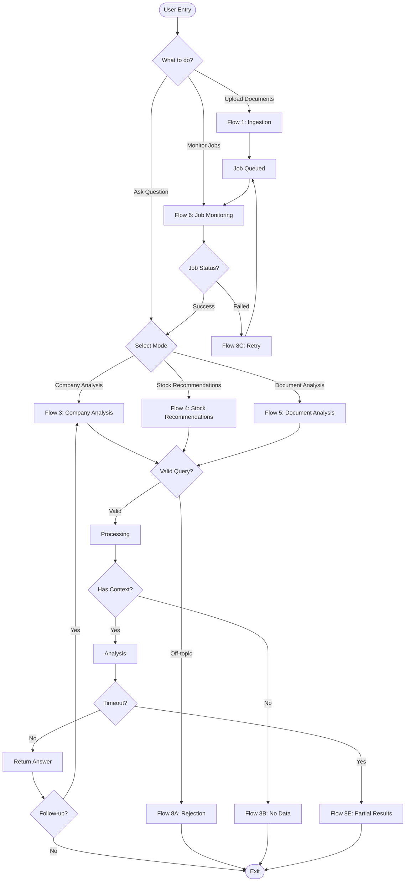
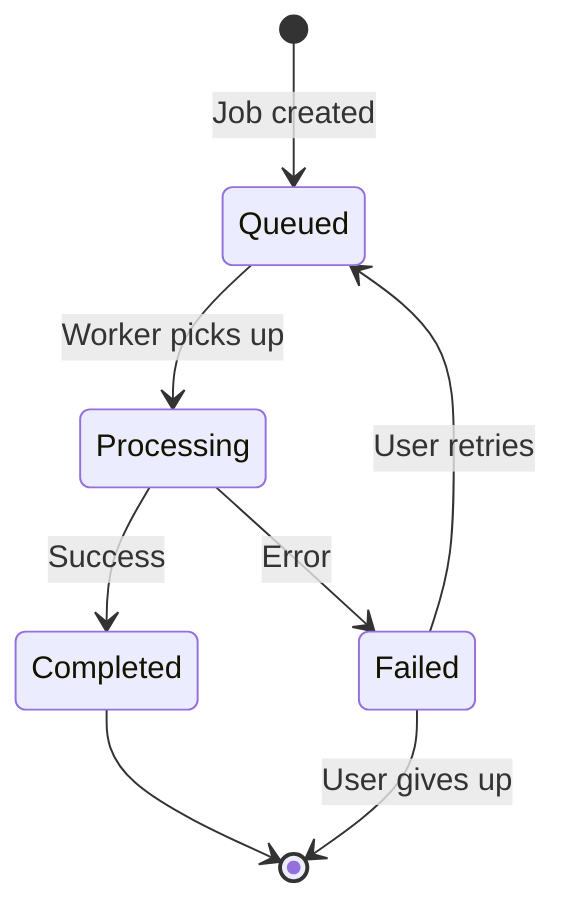
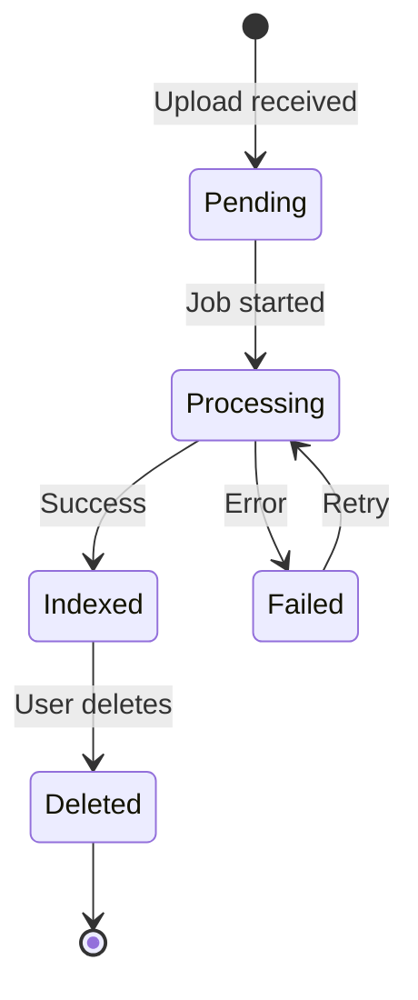
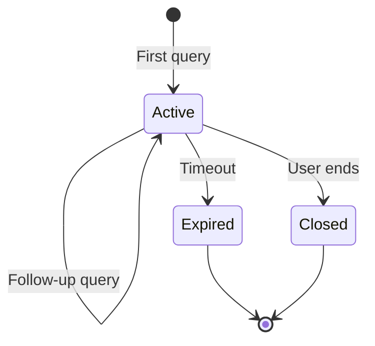

# Core Flows: User Journeys for Modcus v0.2

**Epic:** spec:7a9bea0a-9642-4cd3-b4d3-cbc00fd624f6/30980d13-feb1-4ff7-b94c-cffbb4f7c25f  
**Version:** 0.2.0  
**Status:** Draft  
**Created:** 2026-02-03

---

## Overview

This document defines the complete user journeys for Modcus Core v0.2, describing how users interact with the system from entry to exit. These flows are product-level specifications focusing on user actions, system feedback, and navigation patterns.

**Key Principles:**

- **User-Centric**: Focus on what users do and see, not internal mechanics
- **Feedback-Rich**: Clear communication of progress, success, and errors
- **Consistent**: Predictable patterns across all flows
- **Recoverable**: Graceful error handling with actionable guidance

---

## Flow 1: Document Ingestion

**Description:** User uploads financial documents (PDFs or pre-parsed JSON) for indexing into the knowledge base.

**Entry Point:** API endpoint `POST /v1/ingestion/upload` or web UI upload form

**User Actions:**

1. **Initiate Upload**
  - User selects file(s) from local system
  - Specifies metadata: ticker symbol, document type (annual_report, financial_report, news, etc.)
  - Optionally provides: sector, source URL
  - Submits upload request
2. **Receive Confirmation**
  - System validates file format (auto-detects: Docling JSON, LlamaParse JSON, or raw PDF)
  - System checks for duplicates (same file hash + doc_id)
  - If duplicate: Returns existing document status with `idempotent: true` flag
  - If new: Creates job record and returns `job_id` with status `queued`
3. **Monitor Progress** (Optional)
  - User polls job status via `GET /v1/jobs/{job_id}`
  - System returns progress percentage and current stage
  - Stages displayed: "Queued" → "Parsing" → "Chunking" → "Embedding" → "Indexing" → "Complete"
4. **View Results**
  - On completion: Job status changes to `completed`
  - User can view job logs for detailed processing information
  - Document becomes available for querying

**System Feedback:**

- **Immediate**: File validation errors (unsupported format, too large)
- **Queued**: "Your document is queued for processing. Job ID: {job_id}"
- **Processing**: Progress bar showing percentage and current stage
- **Success**: "Document indexed successfully. Ready for queries."
- **Failure**: Error message with specific issue and suggested action

**Error Scenarios:**

- **Invalid Format**: "Unsupported file type. Please upload PDF or JSON."
- **Duplicate**: "This document already exists (doc_id: {id}). Skipping upload."
- **Queue Full**: "Ingestion queue is full. Please try again in a few minutes."
- **Processing Failed**: "Parsing failed: {reason}. You can retry from the Jobs page."

**Exit Points:**

- Success → Document ready for queries
- Duplicate → No action needed, document already indexed
- Failure → User can retry or contact support

---

## Flow 2: Batch Document Ingestion

**Description:** User uploads multiple documents in a single batch operation with configurable retry strategy.

**Entry Point:** API endpoint `POST /v1/ingestion/batch`

**User Actions:**

1. **Initiate Batch Upload**
  - User selects multiple files (up to 100)
  - Specifies shared metadata: ticker, document type, sector
  - Optionally configures retry strategy:
    - `retry_strategy`: "none" | "transient_only" (default) | "all_errors"
    - `max_retries`: 1-5 (default: 3)
    - `retry_delay_seconds`: Backoff delay (default: 60)
  - Submits batch request
2. **Receive Batch Summary**
  - System returns `batch_id` and per-file results
  - Summary shows: total files, queued, skipped (duplicates), failed
  - Each file gets individual `job_id` or skip reason
  - Retry configuration confirmed
3. **Monitor Batch Progress**
  - User polls batch status via `GET /v1/batches/{batch_id}`
  - System shows aggregate progress: X of Y files completed
  - Individual job statuses available
  - Automatic retries shown: "Retrying job {id} (attempt 2 of 3)"
4. **Review Batch Results**
  - On completion: Batch status shows final counts (including retries)
  - User can drill down into individual job logs
  - Failed jobs (after max retries) can be manually retried

**System Feedback:**

- **Immediate**: Batch validation (file count, formats, retry config)
- **Queued**: "Batch created: {queued} files queued, {skipped} skipped, {failed} failed. Retry strategy: {strategy}"
- **Processing**: "Batch progress: {completed}/{total} files processed ({retrying} retrying)"
- **Retrying**: "Auto-retrying failed jobs (attempt {n} of {max})"
- **Complete**: "Batch complete: {success} succeeded, {failed} failed after retries"

**Exit Points:**

- All success → Batch complete
- Partial success → Review failures, retry if needed
- All failed → Check error messages, fix issues, retry

---

## Flow 3: Company Analysis Query (Mode 1)

**Description:** User asks questions about specific companies. System automatically determines complexity level and provides appropriate depth of analysis.

**Entry Point:** API endpoint `POST /v1/query` with `mode: "company-analysis"`

**User Actions:**

1. **Submit Query**
  - User enters natural language question
  - Optionally specifies ticker symbols (if not, system infers)
  - Selects presentation level: newbie, novice, or expert
  - Submits query
2. **Receive Immediate Feedback**
  - System validates query is finance-related
  - System infers complexity level (configurable: separate LLM call or combined with validation)
  - If off-topic: Returns friendly rejection message
  - If valid: Processing begins
3. **Wait for Response** (2-10 seconds)
  - Progress polling shows current stage
  - No token-by-token streaming in v0.2 (deferred to v0.3)
4. **Review Answer**
  - System presents answer formatted for selected presentation level
  - Answer structure adapts to level (newbie: bullet points with explanations, expert: paragraph-style)
  - Citations show source documents
  - Metadata indicates complexity level used (Simple, Reasoning, or Deep-dive)

**Complexity Level Routing (Automatic):**

The system analyzes the query and routes to appropriate complexity. Inference mechanism is configurable:

- **Separate Mode** (`COMPLEXITY_INFERENCE_MODE=separate`): Dedicated LLM call for classification (adds ~1s latency, more accurate)
- **Combined Mode** (`COMPLEXITY_INFERENCE_MODE=combined`): Single LLM call with validation (default, efficient)

**Complexity Levels:**

- **Simple** (Factual Recall)
  - Example: "What is BBCA's total assets in 2024?"
  - Response: Direct fact with citation
  - Latency: ~2 seconds
- **Reasoning** (Inference & Analysis)
  - Example: "How did BBCA's profitability change from 2023 to 2024?"
  - Response: Comparative analysis with reasoning
  - Latency: ~5 seconds
- **Deep-dive** (Comprehensive Stock Analysis)
  - Example: "Should I invest in BBCA? Analyze their fundamentals."
  - Response: Multi-faceted analysis (financials, ratios, trends, risks, recommendation)
  - Latency: ~10 seconds

**System Feedback:**

- **Validation**: "Analyzing your question..."
- **Ticker Inference**: "Detected companies: BBCA, BMRI"
- **Processing**: "Retrieving financial data..." (if streaming)
- **Complete**: Answer with sources and metadata

**Error Scenarios:**

- **Off-Topic**: "I can only answer questions about finance, investing, and markets. Please ask a finance-related question."
- **Ambiguous Ticker**: "Multiple companies match your query: BBCA, BBRI. Please specify which one."
- **No Data**: "I don't have financial data for this company. Please check the ticker symbol."
- **Timeout**: "Analysis is taking longer than expected. Here's a partial answer based on available data."

**Exit Points:**

- Success → User reads answer, may ask follow-up
- Rejection → User reformulates question
- Error → User retries or contacts support

---

## Flow 4: Stock Recommendation Query (Mode 2)

**Description:** User requests stock recommendations. System analyzes multiple stocks in parallel and provides comparative ranking.

**Entry Point:** API endpoint `POST /v1/query` with `mode: "stock-recommendations"`

**User Actions:**

1. **Submit Recommendation Request**
  - User asks for stock recommendations (e.g., "Recommend 5 banking stocks")
  - Optionally specifies criteria (sector, market cap, etc.)
  - Selects presentation level
  - Submits query
2. **Candidate Selection** (Automatic)
  - System extracts criteria from query (sector, count)
  - Selection strategy:
    - **Default**: Random selection from available stocks in knowledge base
    - **With Sector + Market Cap Data**: Top N by market cap within sector
    - **Explicit Tickers**: Use user-specified tickers
  - If insufficient candidates: Return partial results with explanation
3. **Wait for Analysis** (20-30 seconds)
  - Parallel analysis runs for each stock
  - Progress polling shows: "Analyzing stock 3 of 5..."
4. **Review Recommendations**
  - System presents ranked list of stocks
  - Each stock includes: score, key metrics, rationale
  - Comparative summary explains ranking
  - Citations link to source documents

**System Feedback:**

- **Validation**: "Identifying candidate stocks..."
- **Analysis**: "Analyzing {count} stocks in parallel..."
- **Progress**: "Completed: BBCA ✓, BMRI ✓, BBNI (in progress)..."
- **Complete**: Ranked recommendations with comparative analysis

**Error Scenarios:**

- **Insufficient Data**: "Only 2 of 5 requested stocks have sufficient data. Showing available recommendations."
- **No Matches**: "No stocks match your criteria. Try broadening your search."
- **Timeout**: "Analysis incomplete. Showing partial results for {count} stocks."

**Exit Points:**

- Success → User reviews recommendations, may drill into specific stock
- Partial → User accepts partial results or retries
- Error → User adjusts criteria and retries

---

## Flow 5: Document Analysis Query (Mode 3)

**Description:** User uploads their own documents and asks questions about them (ephemeral analysis).

**Entry Point:** API endpoint `POST /v1/query` with `mode: "document-analysis"`

**Two Sub-Flows:**

### 5A: Upload New Documents

**User Actions:**

1. **Upload Documents**
  - User selects files from local system
  - Enters question about the documents
  - Selects presentation level
  - Submits request
2. **Wait for Ingestion + Query** (30-60 seconds)
  - System creates ephemeral artifact (temporary namespace)
  - Documents are parsed and indexed
  - Query runs against ephemeral index
  - Progress shows: "Processing documents..." → "Analyzing..."
3. **Receive Answer**
  - System presents answer based on uploaded documents
  - Citations reference uploaded files
  - Artifact ID provided for follow-up questions
  - Artifact persists for 24 hours (configurable)
4. **Follow-up Questions** (Optional)
  - User can ask more questions using artifact ID within expiration window
  - No re-upload needed
  - User can manually delete artifact early via API
5. **Artifact Cleanup** (Automatic)
  - Artifacts expire after 24 hours of inactivity
  - User receives notification before expiration (if session active)
  - Expired artifacts are permanently deleted

**System Feedback:**

- **Upload**: "Uploading {count} documents..."
- **Processing**: "Indexing documents (this may take 30-60 seconds)..."
- **Querying**: "Analyzing your documents..."
- **Complete**: Answer with artifact ID for follow-ups

### 5B: Query Existing Artifact

**User Actions:**

1. **Submit Query with Artifact ID**
  - User provides artifact ID from previous upload
  - Enters new question
  - Submits query
2. **Receive Answer** (2-5 seconds)
  - System validates artifact exists and hasn't expired
  - System queries existing ephemeral index
  - No re-processing needed
  - Faster than initial upload
3. **Manage Artifact** (Optional)
  - User can delete artifact early via `DELETE /v1/artifacts/{id}`
  - System confirms deletion and cleanup

**System Feedback:**

- **Validation**: "Loading artifact {id}... (expires in {time})"
- **Querying**: "Analyzing..."
- **Complete**: Answer with citations
- **Expiration Warning**: "Artifact will expire in 1 hour. Upload again to extend."
- **Deleted**: "Artifact deleted successfully."

**Error Scenarios:**

- **Upload Failed**: "Document processing failed: {reason}. Please try again."
- **Artifact Not Found**: "Artifact {id} not found or expired. Please re-upload documents."
- **Artifact Expired**: "Artifact {id} expired after 24 hours. Please re-upload your documents."
- **No Relevant Content**: "Your documents don't contain information to answer this question."

**Exit Points:**

- Success → User gets answer, can ask follow-ups
- Failure → User retries upload or adjusts question

---

## Flow 6: Job Monitoring & Management

**Description:** User tracks ingestion job progress and manages failed jobs.

**Entry Point:** API endpoint `GET /v1/jobs/{job_id}` or web UI jobs dashboard

**User Actions:**

1. **View Job Status**
  - User navigates to jobs list or specific job
  - System displays: status, progress, stage, timestamps
  - Real-time updates if polling or WebSocket enabled
2. **View Job Logs**
  - User clicks "View Logs" for detailed information
  - System streams log file content
  - Logs show: parsing details, chunk counts, errors
3. **Retry Failed Job** (If applicable)
  - User clicks "Retry" on failed job
  - Optionally selects resume point: from parsing or from ingestion
  - System re-queues job with incremented attempt counter
4. **Delete Job** (If applicable)
  - User clicks "Delete" to remove job record
  - System confirms deletion
  - Associated documents remain unless explicitly deleted

**System Feedback:**

- **Status Display**: Visual indicator (icon + color) for each status
  - Queued: ⏳ Gray
  - Processing: ⚙️ Blue (with progress bar)
  - Completed: ✅ Green
  - Failed: ❌ Red
- **Progress Details**: "Parsing: 45% (page 90 of 200)"
- **Logs**: Real-time streaming with syntax highlighting
- **Retry Confirmation**: "Job re-queued. Attempt 2 of 3."

**Exit Points:**

- Monitoring → User satisfied with progress
- Retry → Job re-queued, user monitors again
- Delete → Job removed from list

---

## Flow 7: Chat Session Management

**Description:** User engages in multi-turn conversation with context retention.

**Entry Point:** API endpoint `POST /v1/query` with `conversation_id` parameter

**User Actions:**

1. **Start Conversation**
  - User submits first query (any mode)
  - System generates `conversation_id` and returns it
  - Answer includes conversation context
2. **Continue Conversation**
  - User submits follow-up question with same `conversation_id`
  - System retrieves full conversation history
  - If approaching context window limit: System creates summary branch
  - Answer considers previous context
3. **End Conversation**
  - User stops sending queries
  - Session expires after inactivity timeout (default: 2 hours, configurable)
  - Or user explicitly ends via API call

**History Management:**

- **Full History**: All turns preserved by default
- **Summarization**: When approaching LLM context window limit:
  - System creates compressed summary of older turns
  - Creates "branch" preserving original conversation
  - New queries use summary + recent turns
- **Storage**: Conversation history persisted in database
- **Timeout**: Configurable per deployment (default: 2 hours)

**System Feedback:**

- **New Session**: "Starting new conversation (ID: {id})"
- **Continuing**: "Continuing conversation (turn {n})"
- **Summarized**: "Conversation summarized to fit context window (original preserved)"
- **Context Used**: Metadata shows which previous turns were referenced
- **Expiring Soon**: "Session will expire in 15 minutes due to inactivity"

**Exit Points:**

- Natural end → User stops asking questions
- Explicit end → User closes session
- Timeout → Session expires automatically (2 hours default)

---

## Flow 8: Error Recovery & Safe-guards

**Description:** How the system handles various error conditions and guides users to resolution.

### 8A: Off-Topic Query Rejection

**Trigger:** User asks non-finance question

**Flow:**

1. Validation Agent classifies query as off-topic
2. System returns friendly rejection message
3. User reformulates question or exits

**Message Examples:**

- "I specialize in finance, investing, and markets. I can't help with weather forecasts."
- "That's outside my expertise. Try asking about company financials, stock analysis, or market trends."

### 8B: No Relevant Context

**Trigger:** Query is finance-related but no indexed documents match

**Flow:**

1. Retrieval Agent finds no relevant chunks
2. System returns honest "no data" response
3. User can upload documents or adjust query

**Message Examples:**

- "I don't have financial data for this company. Please check the ticker symbol or upload relevant documents."
- "No documents in the knowledge base match your query. Try a different company or time period."

### 8C: Ingestion Failure

**Trigger:** Document processing fails during ingestion

**Flow:**

1. Job status changes to `failed`
2. Error code and message stored in job record
3. System determines if error is transient or permanent
4. **If transient** (rate limit, network): Automatic retry with exponential backoff (max 3 attempts)
5. **If permanent** (invalid format, corrupted file): No automatic retry, user must fix issue
6. User views error in job details
7. User can manually retry with options (from parsing or from ingestion)

**Message Examples:**

- **Permanent Error**: "Parsing failed: PDF is password-protected. Please provide an unlocked version. (No automatic retry)"
- **Transient Error**: "Embedding failed: LLM API rate limit exceeded. Auto-retrying in 60 seconds (attempt 1 of 3)."
- **Max Retries Reached**: "Job failed after 3 retry attempts. Last error: {reason}. Manual retry available."

### 8D: LLM Provider Failure

**Trigger:** Primary LLM provider is unavailable or rate-limited

**Flow:**

1. System detects LLM error
2. Automatic rotation to backup API key or provider
3. Query retried transparently
4. User sees slight delay but no error

**Message Examples:**

- (Internal log): "Primary LLM key rate-limited. Rotating to backup key."
- (User sees): Normal response with slightly higher latency

### 8E: Timeout Handling

**Trigger:** Query exceeds timeout threshold

**Flow:**

1. System detects timeout approaching
2. Returns partial results with metadata flag
3. User can retry or accept partial answer

**Message Examples:**

- "Analysis is taking longer than expected. Here's what I found so far: [partial answer]. Metadata: `partial: true`"

---

## Flow 9: Document Deletion

**Description:** User removes documents from the knowledge base (full cleanup).

**Entry Point:** API endpoint `DELETE /v1/documents/{doc_id}`

**User Actions:**

1. **Initiate Deletion**
  - User selects document(s) to delete
  - System shows confirmation dialog with impact warning
  - Warning specifies: "This will delete raw files, parsed data, vector embeddings, and database records"
  - User confirms deletion
2. **Deletion Processing**
  - System removes document from vector store
  - Deletes raw files from storage
  - Deletes parsed/interim files
  - Updates database records (marks as deleted)
  - Logs deletion in audit trail with full scope
3. **Confirmation**
  - System confirms successful deletion
  - Shows what was deleted (file paths, chunk count)
  - Provides audit log ID for tracking
  - Shows updated document count

**System Feedback:**

- **Warning**: "This will permanently delete {doc_id} including all raw files, parsed data, and vector embeddings. This action cannot be undone."
- **Processing**: "Deleting document from knowledge base and storage..."
- **Progress**: "Removed {n} chunks from vector store, deleted {m} files"
- **Success**: "Document deleted successfully. Audit log ID: {log_id}"

**Exit Points:**

- Success → Document removed, knowledge base updated
- Cancel → No changes made

---

## User Journey Map



---

## Interaction Patterns

### Progress Communication

**Pattern:** All long-running operations provide progress feedback

**Implementation:**

- Percentage complete (0-100%)
- Current stage name
- Estimated time remaining (optional)
- Real-time updates via polling or streaming

**Example:**

```json
{
  "job_id": "abc-123",
  "status": "processing",
  "progress": 45,
  "stage": "embedding",
  "message": "Generating embeddings for 450 chunks..."
}
```

### Error Messages

**Pattern:** All errors include actionable guidance

**Structure:**

- What went wrong (clear, non-technical)
- Why it happened (if known)
- What user can do next (specific action)

**Example:**

```json
{
  "error": "Document parsing failed",
  "reason": "PDF is password-protected",
  "action": "Please provide an unlocked PDF or contact support",
  "error_code": "PARSE_PROTECTED_PDF"
}
```

### Citations & Sources

**Pattern:** All answers include source attribution

**Structure:**

- Document reference (ticker, doc_type, date)
- Page or section number
- Relevance score
- Snippet preview

**Example:**

```json
{
  "sources": [
    {
      "doc_id": "BBCA_annual_report_2024",
      "page": 45,
      "score": 0.92,
      "snippet": "Total assets increased to Rp 1.2 trillion..."
    }
  ]
}
```

### Idempotency

**Pattern:** Duplicate operations are safely handled

**Behavior:**

- Same file + metadata → Returns existing document
- Same query + conversation_id → Uses cached result (optional)
- Same job retry → Increments attempt counter

**Feedback:**

```json
{
  "doc_id": "BBCA_annual_report_2024",
  "status": "completed",
  "idempotent": true,
  "message": "Document already indexed"
}
```

---

## State Transitions

### Job Lifecycle



### Document Status



### Conversation Session



---

## Accessibility & Usability

### Response Time Expectations


| Operation             | Target | Maximum | User Feedback                |
| --------------------- | ------ | ------- | ---------------------------- |
| Simple Query          | < 2s   | 5s      | Instant answer               |
| Reasoning Query       | < 5s   | 10s     | "Analyzing..."               |
| Deep-dive Query       | < 10s  | 20s     | Progress indicator           |
| Stock Recommendations | < 30s  | 60s     | "Analyzing X of Y stocks..." |
| Document Upload       | < 60s  | 300s    | Progress bar with stages     |


### Presentation Levels

**Formatting Philosophy:**

- All levels provide the same depth of information and detail
- Difference is in structure, language, and pedagogical approach
- No information is omitted at any level

**Newbie:**

- **Structure**: Bullet points, numbered lists, clear sections
- **Language**: Simple terms, analogies, everyday examples
- **Pedagogy**: Define complex terms, explain "why" behind concepts
- **Example**: "ROE (Return on Equity) is like measuring how well a company uses shareholder money. Think of it as: for every Rp 100 invested, how much profit is generated?"

**Novice:**

- **Structure**: Balanced paragraphs with key metrics highlighted
- **Language**: Standard finance terminology with brief context
- **Pedagogy**: Assumes basic knowledge, focuses on insights
- **Example**: "ROE of 15.2% indicates strong profitability, above the industry average of 14.1%."

**Expert:**

- **Structure**: Dense paragraphs, data-first presentation
- **Language**: Technical jargon, industry shorthand
- **Pedagogy**: Minimal explanation, assumes deep expertise
- **Example**: "ROE: 15.2% (+1.8pp YoY). Drivers: NI ↑12%, equity ↑4%. Peer avg: 14.1%."

---

## Deployment Considerations

### Docker Compose Deployment Options

Modcus v0.2 provides **3 deployment strategies** for different use cases:

**Option 1: All-in-One Deployment**

- **File**: `docker-compose.yml` (root level)
- **Command**: `docker compose up -d`
- **Includes**: Ingestion API, Query API, PostgreSQL, Vector DB, Redis
- **Use Case**: Development, testing, simple production deployments
- **Pros**: Single command, easy setup
- **Cons**: All services restart together, harder to scale independently

**Option 2: Per-Service Deployment**

- **Files**: 
  - `docker-compose.ingest.yml` - Ingestion service
  - `docker-compose.query.yml` - Query service
  - `docker-compose.postgres.yml` - PostgreSQL
  - `docker-compose.vector.yml` - Vector database
  - `docker-compose.redis.yml` - Redis (Celery broker)
- **Command**: `docker compose -f docker-compose.query.yml up -d` (per service)
- **Use Case**: Production, independent scaling, service isolation
- **Pros**: Fine-grained control, independent scaling, isolated restarts
- **Cons**: More complex orchestration

**Option 3: Dependencies Only**

- **File**: `docker-compose.deps.yml` (root level)
- **Command**: `docker compose -f docker-compose.deps.yml up -d`
- **Includes**: PostgreSQL, Vector DB, Redis (storage backends only)
- **Use Case**: Local development with hot-reload, hybrid deployments, Kubernetes
- **Pros**: Services run natively (faster iteration), flexible deployment
- **Cons**: Requires manual service startup

**Future (v0.3):**

- Add MinIO to all deployment configurations
- MinIO replaces local file storage for production deployments

---

## Next Steps

After this Core Flows spec is approved, proceed with:

1. **PRD Validation** - Review flows for completeness and clarity ✅ COMPLETED
2. **Technical Architecture** - Design LangGraph state machines and agent interactions
3. **API Contract** - Define OpenAPI spec based on these flows
4. **Deployment Configuration** - Create Docker Compose files for 3 deployment options

---

**Document Status:** ✅ Validated & Complete  
**Next Action:** workflow:271192ed-bf0b-4f43-9915-d77b9e7dbb04/tech-plan